# <p align = 'center'>**Zoo Management System - ZMS**</p>
<p align ='center'> Developed by TeamDB - L10 - HK241</p> 

## Table of content
- [Introduction](#introduction)
- [Technologies Used](#technologies-used)
- [Source code](#source-code)
- [Data Requirements Description for the Zoo Management System](#data-requirements-description-for-the-zoo-management-system)
- [Semantic Constraints](#semantic-constraints)
- [Enhanced Entity Relationship Diagram EERD and Mapping](#enhanced-entity-relationship-diagram-eerd-and-mapping)
- [Database Schema Design in MySQL](#database-schema-design-in-mysql)
- [Source Code Structure](#source-code-structure)
- [Implementation](#implementation)
- [DEMO Features](#demo-features)
- [Installation Guide](#installation-guide)
- [Contributors](#contributors)

## **📌Introduction**
🦁 The Zoo Management System is a comprehensive application that supports the digital transformation of modern zoos. It provides powerful tools for managing animal species, individual animals, staff (including office workers, caretakers, and veterinarians), and diverse partner types such as food suppliers, research institutions, and other zoos. The system allows tracking of health records, vaccination history, treatment logs, and nutrition plans for both individual animals and groups. 

🦁 It also manages enclosures, feeding schedules, specimen records, and the logistics of animal import/export operations. With rich relational data handling, it ensures accurate monitoring of predator-prey relationships, breeding records, and parentage, supporting both operational and conservation needs.

<p align="center">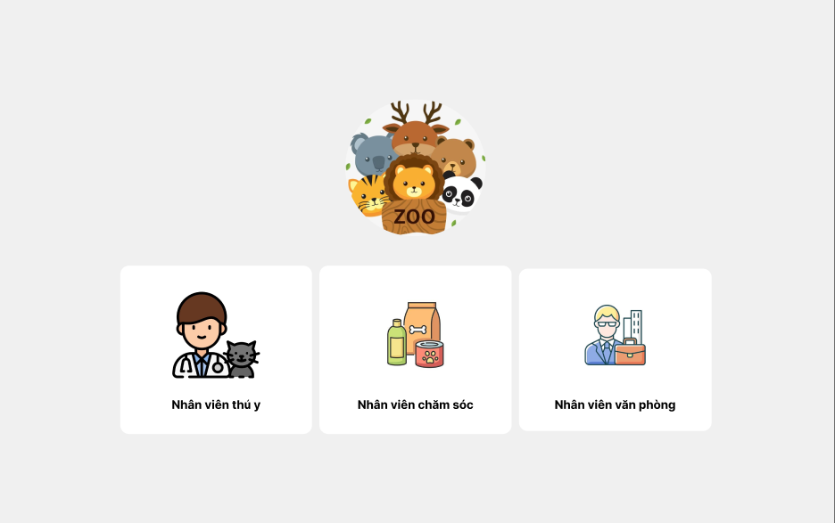</p>
<p align="center">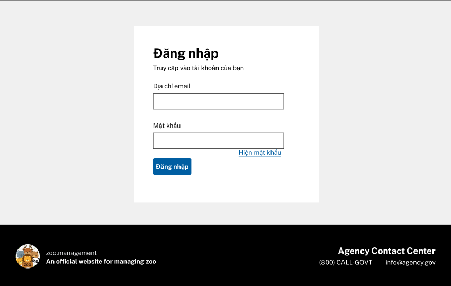</p>

## 🛠**Technologies Used**

- Frontend: `HTML, CSS, JS(ReactJS)` – Used to build a responsive and user-friendly web interface.

- Backend: `NestJS` – A progressive Node.js framework used to create a structured and scalable server-side application. It communicates with the database through stored procedures and functions.
- Database: `MySQL` – Relational database system used to store and manage zoo data, with business logic implemented through stored procedures and functions.

- API & Testing: `Postman` – A powerful API testing and debugging tool, streamlining API development and ensuring reliability through structured request-response testing.

- Version Control & Collaboration: `GitHub` – A cloud-based version control system facilitating seamless code management, collaboration, and deployment with features like branching, pull requests, and issue tracking.

- **Features**:
  - ✅ Authentication & Authorization
  - ✅ CRUD operations for zoo data (animals, health records, partners, etc.)

> ⚠️ You can create your own local database using the `Database.sql` file provided in the root directory.

<p align="center">
  <a href="http://nestjs.com/" target="blank"></a>
</p>

[circleci-image]: https://img.shields.io/circleci/build/github/nestjs/nest/master?token=abc123def456
[circleci-url]: https://circleci.com/gh/nestjs/nest

  <p align="center">A progressive <a href="http://nodejs.org" target="_blank">Node.js</a> framework for building efficient and scalable server-side applications.</p>
    <p align="center">
<a href="https://www.npmjs.com/~nestjscore" target="_blank"></a>
<a href="https://www.npmjs.com/~nestjscore" target="_blank"></a>
<a href="https://www.npmjs.com/~nestjscore" target="_blank"></a>
<a href="https://circleci.com/gh/nestjs/nest" target="_blank"></a>
<a href="https://coveralls.io/github/nestjs/nest?branch=master" target="_blank"></a>
<a href="https://discord.gg/G7Qnnhy" target="_blank"></a>
<a href="https://opencollective.com/nest#backer" target="_blank"></a>
<a href="https://opencollective.com/nest#sponsor" target="_blank"></a>
  <a href="https://paypal.me/kamilmysliwiec" target="_blank"></a>
    <a href="https://opencollective.com/nest#sponsor"  target="_blank"></a>
  <a href="https://twitter.com/nestframework" target="_blank"></a>
</p>
  <!--[](https://opencollective.com/nest#backer)
  [](https://opencollective.com/nest#sponsor)-->


## 🚀**Source code:**
The source code of the software can be accessed via the following link:

🔗 [Source code backend](https://github.com/tuitensonne/Zoo-backend)

🔗 [Source code frontend](https://github.com/tuitensonne/Zoo-frontend)

🔗 [UI/UX Design (Figma)](https://www.figma.com/design/ublOB0fGMaNA7qOHDUZynx/Untitled?node-id=0-1&t=DKyjMi1vJae1QkcB-1)

## 📌**Data Requirements Description for the Zoo Management System** 
### 🚀 **Staff – Office Staff – Caretakers – Veterinarians**:

The system needs to manage information about employees related to animals, including office staff, caretakers, and veterinarians. Each staff member has general information including:
- Citizen ID number (CCCD) (unique)
- Full name
- Address
- Job type
- Phone number(s) (one staff may have multiple)

Additional requirements based on role:
- `Office Staff`: must include information about qualifications
- `Caretakers`: must have an animal care certificate
- `Veterinarians`: must have a practicing license and years of experience

### 🚀 **Partners – Research Institutes – Zoos – Food Suppliers**:

The system must manage information about zoo partners, including food suppliers, educational institutions, zoos, and research institutes. Each partner includes:
- Partner ID (ID_DT) (unique)
- Name
- Contact info: email, address, and phone numbers (can be multiple)

Additional requirements:
- `Food Suppliers`: Must include food safety certifications (can be multiple). Ordering limits per food type (e.g., 50kg)
- `Zoos`: Type of zoo (public, private, non-profit). Conservation programs (e.g., species conservation, gene conservation)
- `Research Institutes`: Must include research fields

### 🚀 **Animal Species – Group – Individual – Enclosure – Specimen**:

Each animal species must have:
- Scientific name (unique)
- Common name
- Rarity level
- Type of food
- Reproduction cycle: cycle duration & gestation period
- Natural habitat
- Predator-prey relationships

- Animals can be tracked as `groups` or `individuals`:
  - Group:
    - Linked to species
    - Requires: Group ID (ID_N) and quantity
    - The combination of ID_N + species’ scientific name is unique
  - Individual:
    - Requires: ID_CT, DNA, gender, status, age
    - May include father and mother references

- Enclosure:
  - Enclosure ID (ID_KV) (unique)
  - Dimensions: area, height
  - Habitat type
  - Location
  - Maximum capacity
  - Activity status
  - Current quantity of animals (individuals + groups)
- Specimen:
  - Specimen ID (ID_MV)
  - Species
  - Specimen name
  - Condition
  - Collection date
 
### 🚀 **Nutrition Plan – Health Record – Treatment History – Vaccination History – Meal**:
- Nutrition Plan:
  - ID_CDDD (linked to health record)
  - Required water amount
  - Number of meals/day
  - Restricted foods
  - Minimum nutritional values
- Health Record:
  - ID_HSSK
  - Health status, height, weight
- Treatment History:
  - ID_DT, symptoms, medications, diagnosis, treatment outcome, notes, treatment date
- Vaccination History:
  - ID_TC, vaccine type, dosage, post-vaccine reaction, date, method of administration
- Meal:
  - Meal name, feeding time, species, and feeding date

### 🚀 **Import Forms – Animal Import – Food Import – Food – Animal Export**:
- Import Forms:
  - ID_PN, import date, quantity
  - Two types:
    - `Food Import`: requires origin/source
    - `Animal Import`: requires import reason
- Animal Export Forms:
  - ID_PX, export date, description (including quantity and reason)
- Food Item:
  - ID_TA, total quantity, name, nutritional content, expiration date

### 🚀 **Relationships**:

- Species–Predator-Prey:
  - A species can have multiple predators, and predators can hunt multiple prey
- Animal–Enclosure:
  - Each group/individual must reside in one `enclosure`
  - Each enclosure may contain multiple groups/individuals
- Animal–Health Record:
  - Each group/individual must have one health record
  - A health record can be linked to:
    - Multiple `nutrition plans`
    - Multiple `treatment histories`
    - Multiple `vaccination histories`
- Veterinarian Involvement:
  - Each health record must be modified by one veterinarian
  - Each veterinarian can modify multiple health records
  - Each nutrition plan is adjusted by one veterinarian
  - Each nutrition plan can be linked to multiple meals
- Caretaker Roles:
  - Performs meals for multiple enclosures
  - Each enclosure is cared for based on one meal at a specific time by one caretaker
  - A caretaker may serve multiple meals for the same enclosure at different times
  - Feeding date must be recorded
- Office Staff & Forms:
  - One office staff may create multiple: `Import forms`, `Animal export forms`
- Food Import – Supplier:
  - Each food import form is linked to one food supplier
  - One supplier may have multiple food import forms
- Food Item Usage:
  - A food item may appear in multiple food import forms
  - A meal may contain multiple food items
  - Must record quantity used per meal
- Animal Import/Export – Zoo Partners:
  - Each form is associated with one zoo
  - Each zoo partner may be involved in multiple imports/exports
- Animal Rental:
  - Individual animals may be rented out to other zoos
  - Each zoo may rent multiple individual animals
- Specimen Ownership:
  - Each `individual` may have multiple `specimens`
  - Each `specimen` belongs to one `individual`
  - `Research institutes` store specimens (one specimen belongs to one institute)
- Animal Lineage:
  - Each individual must have one father and one mother
  - One individual can be a parent of many others
- Group & Individual:
  - Animals may be in groups or individuals
  - A species might have no groups/individuals if population = 0
- Species Relations:
  - Each species:
    - Has multiple `groups`
    - Has multiple `individuals`
    - May be involved in `multiple import/export forms`
## 📌**Semantic Constraints** 
- The total `"quantity"` of all groups and individual animals with the status `"alive"` of a particular species must equal the `"quantity"` of that animal species.
- An animal species will by `default participate` in the "division" relationship if the user has not decided to assign it to either of the two relationships.
- If an individual `has a "has" relationship` with a specimen, it cannot be deleted unless the specimen is deleted first.
- The attribute `"habitat type"` of an animal species must be one of the three values: terrestrial, aquatic, or both.
- The attribute `"food type"` must be one of the three values: carnivore, herbivore, or omnivore.
- The `quantity of an animal species` must not be negative.
- The `current number of animals` in an enclosure must be `less than or equal` to its `maximum capacity`.
- When an `animal import` form is created, the `quantity of the animal species` must be `increased` by the quantity in the import form.
- When an `animal export` form is created, the `quantity of the animal species` must be `decreased` by the quantity in the export form.
- The `habitat type of the enclosure` must `match the habitat type` of the animal species housed in it.
- The `group quantity must not be negative`.
- The `current quantity` of animals in an enclosure must not be negative.
- Animal species that are `prey` of other species (in the recursive `"eats" relationship`) **cannot be housed in the same enclosure** as their predator species.
- The `"gender"` attribute of an individual must be one of three values: `"hermaphrodite", "male", or "female".`
- The `"status"` attribute of an individual must be one of five values: `"dead", "for rent", "sold", "alive", or "rented".`
- The `activity status` of an enclosure must be one of two values: `"in use"` or `"under maintenance".`

## 📌**Enhanced Entity Relationship Diagram EERD and Mapping**
### **EERD Diagram**

<p align="center">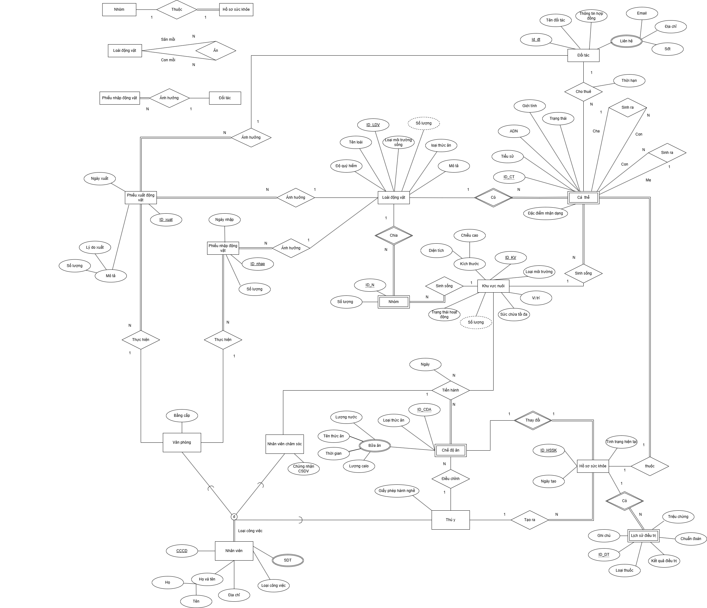</p>

### **Mapping to Relational Schema**

<p align="center">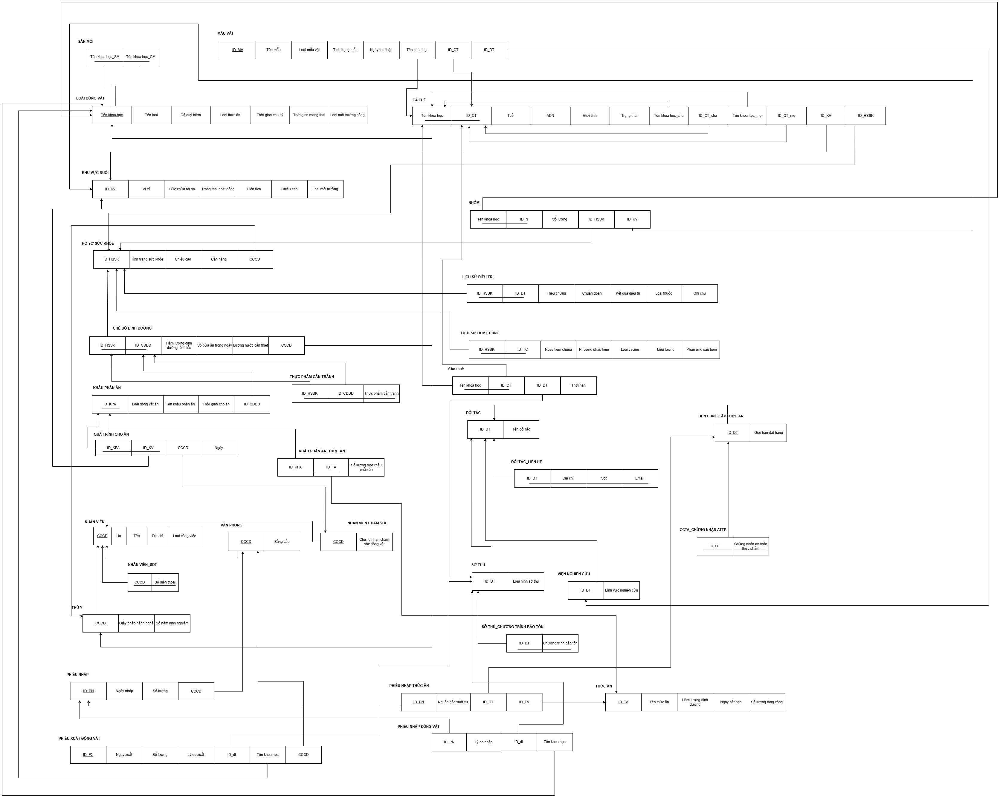</p>

## 📌**Database Schema Design in MySQL** 

- Data Insertion
  - Animal Species
<p align="center">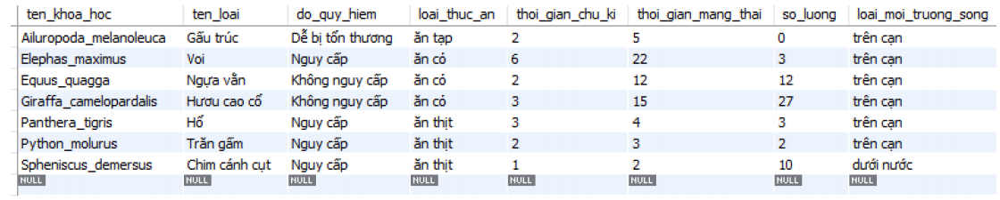</p>
  - Predation
<p align="center">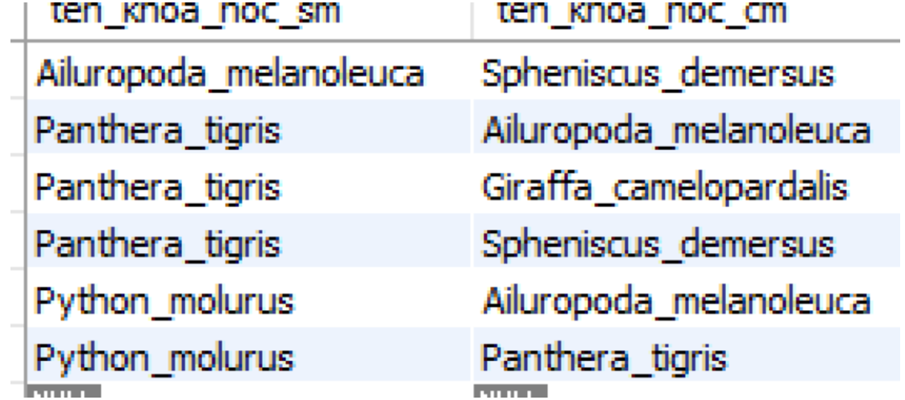</p>
  - Enclosure
<p align="center">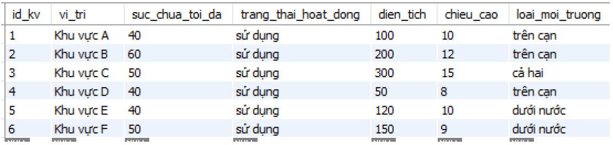</p>
  - Staff
<p align="center">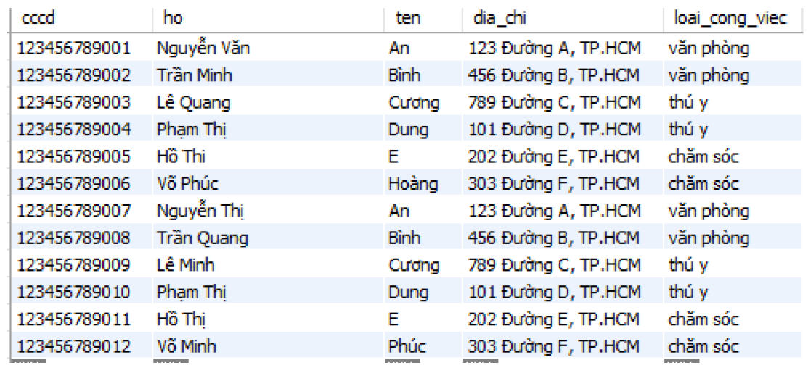</p>
  - Staff Phone Numbers
<p align="center">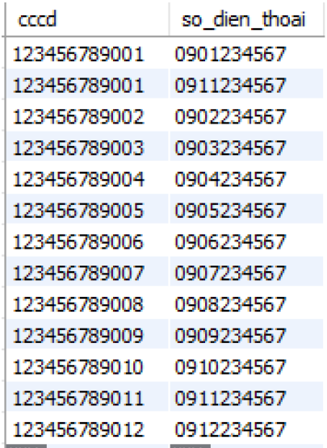</p>
  - Office Staff
<p align="center">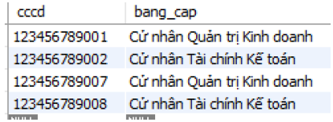</p>
  - Veterinarians
<p align="center">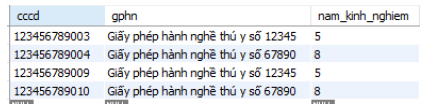</p>
  - Caretakers
<p align="center">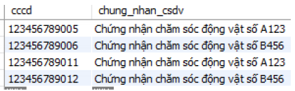</p>
  - Health Records
<p align="center">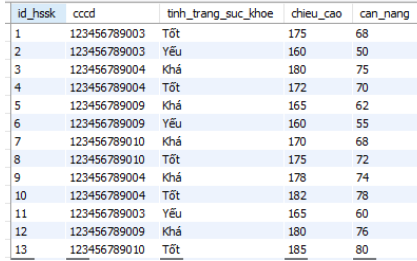</p>
  - Vaccination History
<p align="center">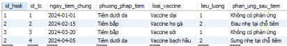</p>
  - Treatment History
<p align="center">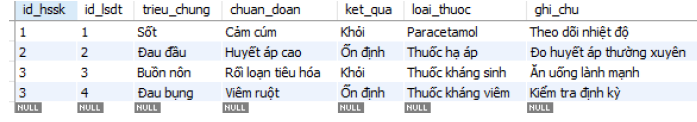</p>
  - Nutrition Plan
<p align="center">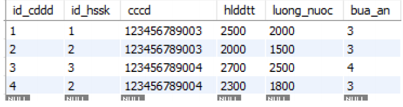</p>
  - Restricted Foods
<p align="center">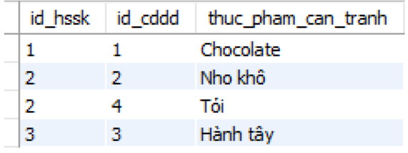</p>
  - Meal
<p align="center">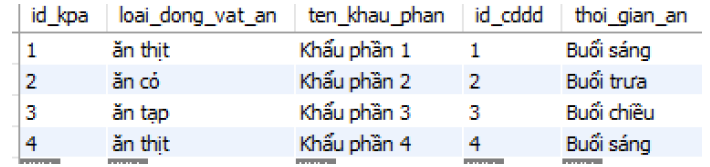</p>
  - Feeding Process
<p align="center"></p>
  - Food Items
<p align="center">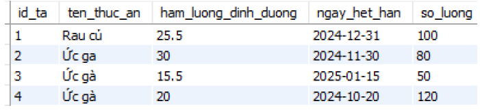</p>
  - Partners
<p align="center">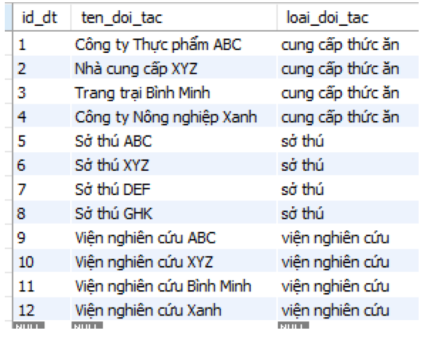</p>
  - Partner Contact Details
<p align="center">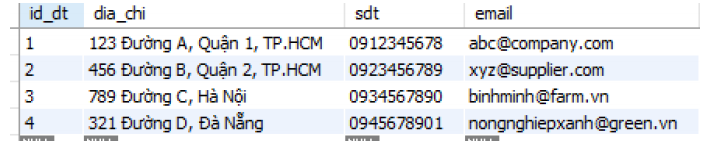</p>
  - Research Institute Partners
<p align="center">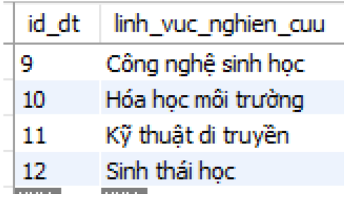</p>
  - Zoo Partners
<p align="center">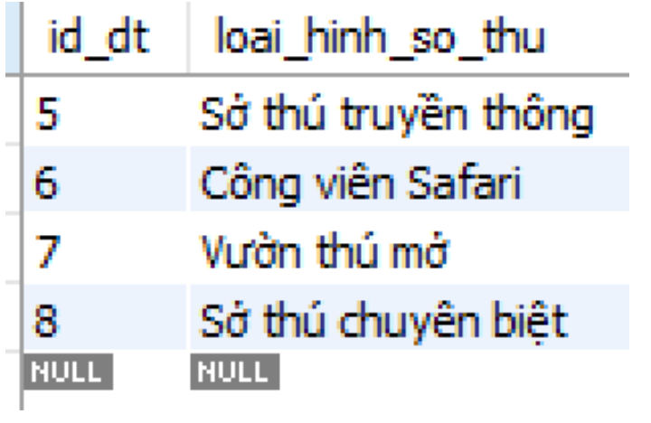</p>
  - Zoo Conservation Programs
<p align="center">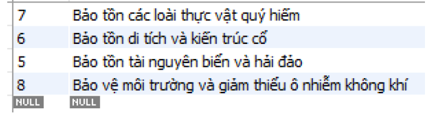</p>
  - Food Supplier Partners
<p align="center">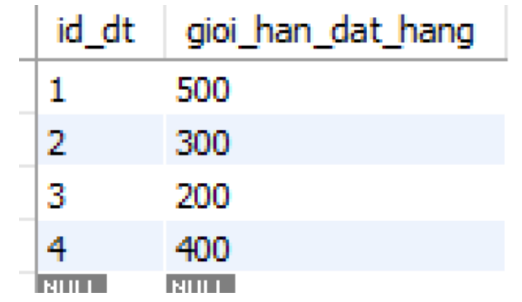</p>
  - Food Safety Certifications
<p align="center">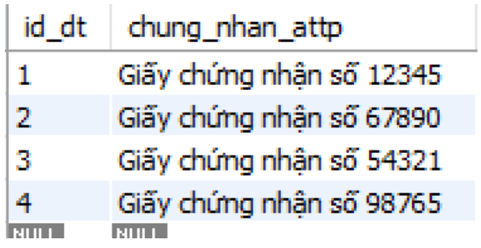</p>
  - Import Forms
<p align="center">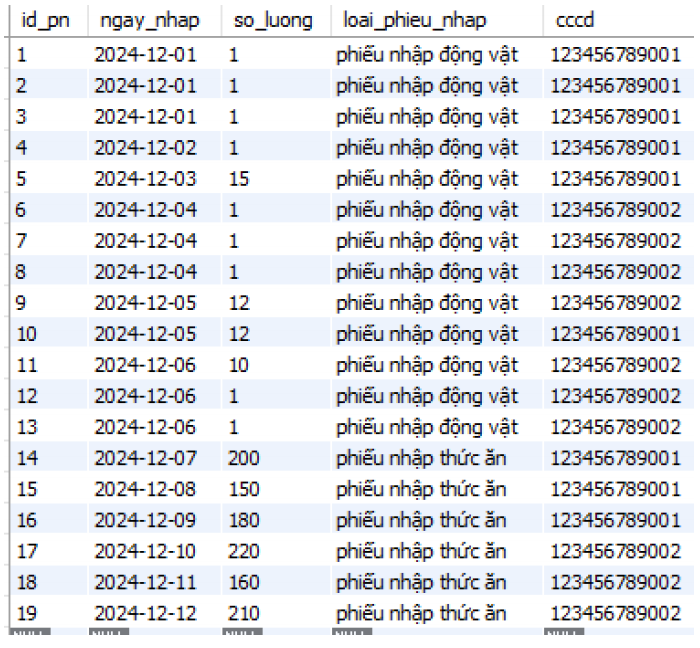</p>
  - Food Import Forms
<p align="center">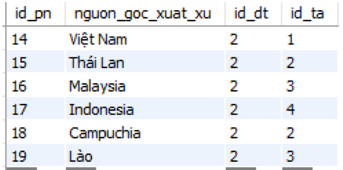</p>
  - Animal Import Forms
<p align="center">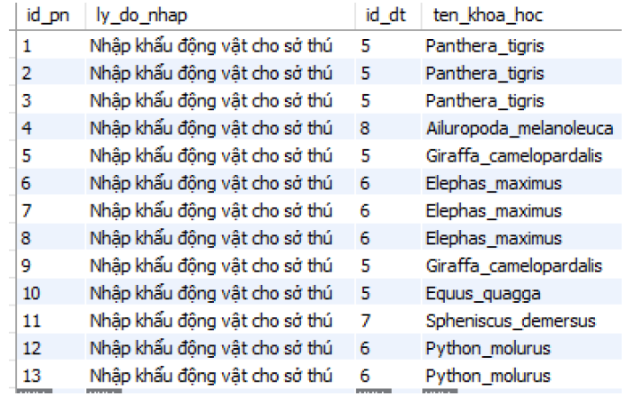</p>
  - Individual Animals
<p align="center">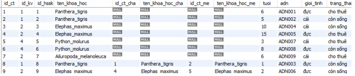</p>
  - Animal Groups
<p align="center">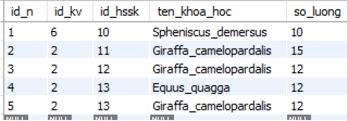</p>
  - Rented Individuals
<p align="center"></p>
  - Animal Export Forms
<p align="center">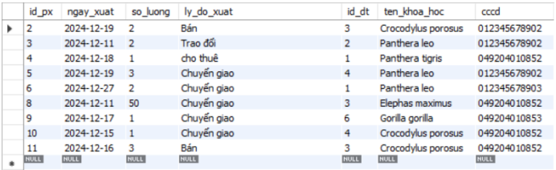</p>
  - Specimens
<p align="center">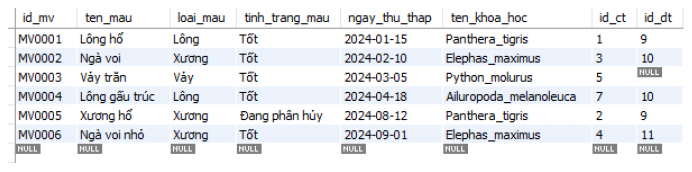</p>

## 📌**Procedure** 
### **Procedure for Animal Import Records**

- `add_phieu_nhap_dong_vat_ct`: This procedure creates an animal import record in the `phieu_nhap_dong_vat` table, and then creates an individual record in the `ca_the` table. If any error occurs during creation, it will rollback the transaction.
  ``` sql
  CREATE PROCEDURE add_phieu_nhap_dong_vat_ct(     
      IN p_cccd CHAR(12) CHARACTER SET utf8mb4 COLLATE utf8mb4_unicode_ci,     
      IN p_id_so_thu INT,     
      IN p_ten_khoa_hoc VARCHAR(50) CHARACTER SET utf8mb4 COLLATE utf8mb4_unicode_ci,     
      IN p_ngay_nhap DATE,     
      IN p_so_luong INT,     
      IN p_ly_do_nhap VARCHAR(50) CHARACTER SET utf8mb4 COLLATE utf8mb4_unicode_ci,
      IN p_id_kv INT,                 
      IN p_id_hssk INT,           
      IN p_id_ct_cha INT,  
      IN p_ten_khoa_hoc_cha VARCHAR(255) CHARACTER SET utf8mb4 COLLATE utf8mb4_unicode_ci,
      IN p_id_ct_me INT,      
      IN p_ten_khoa_hoc_me VARCHAR(255) CHARACTER SET utf8mb4 COLLATE utf8mb4_unicode_ci, 
      IN p_tuoi INT,                  
      IN p_adn VARCHAR(255) CHARACTER SET utf8mb4 COLLATE utf8mb4_unicode_ci,         
      IN p_gioi_tinh VARCHAR(10) CHARACTER SET utf8mb4 COLLATE utf8mb4_unicode_ci,   
      IN p_trang_thai VARCHAR(50) CHARACTER SET utf8mb4 COLLATE utf8mb4_unicode_ci   
  ) 
  BEGIN 
      DECLARE last_insert_id INT; 

      START TRANSACTION; 

      IF NOT EXISTS (SELECT 1 FROM dt_so_thu WHERE id_dt = p_id_so_thu) OR p_id_so_thu != NULL THEN 
          ROLLBACK;
          SIGNAL SQLSTATE '45000' 
          SET MESSAGE_TEXT = 'Doi tac khong ton tai.'; 
      END IF; 

      IF NOT EXISTS (SELECT 1 FROM nv_van_phong WHERE cccd = p_cccd) THEN 
          ROLLBACK;
          SIGNAL SQLSTATE '45000' 
          SET MESSAGE_TEXT = 'Nhan vien khong ton tai.'; 
      END IF; 

      INSERT INTO phieu_nhap (ngay_nhap, so_luong, cccd, loai_phieu_nhap) 
      VALUES (p_ngay_nhap, p_so_luong, p_cccd, 'phieu nhap dong vat'); 

      SET last_insert_id = LAST_INSERT_ID(); 

      IF last_insert_id IS NULL THEN 
          ROLLBACK;
          SIGNAL SQLSTATE '45000' 
          SET MESSAGE_TEXT = 'Khong the chen du lieu vao phieu nhap.'; 
      END IF; 

      INSERT INTO phieu_nhap_dong_vat (id_pn, ly_do_nhap, id_dt, ten_khoa_hoc) 
      VALUES (last_insert_id, p_ly_do_nhap, p_id_so_thu, p_ten_khoa_hoc); 

      IF ROW_COUNT() = 0 THEN 
          ROLLBACK;
          SIGNAL SQLSTATE '45000' 
          SET MESSAGE_TEXT = 'Khong the chen du lieu vao phieu nhap dong vat.'; 
      END IF; 
      
      IF NOT EXISTS (SELECT 1 FROM khu_vuc_nuoi WHERE id_kv = p_id_kv) THEN
          ROLLBACK;
          SIGNAL SQLSTATE '45000'
          SET MESSAGE_TEXT = 'ID khu vuc khong ton tai.';
      END IF;

      IF NOT EXISTS (SELECT 1 FROM ho_so_suc_khoe WHERE id_hssk = p_id_hssk) THEN
          ROLLBACK;
          SIGNAL SQLSTATE '45000'
          SET MESSAGE_TEXT = 'ID ho so suc khoe khong ton tai.';
      END IF;

      IF p_id_ct_cha IS NOT NULL AND NOT EXISTS (SELECT 1 FROM ca_the WHERE id_ct = p_id_ct_cha AND ten_khoa_hoc = p_ten_khoa_hoc_cha) THEN
          ROLLBACK;
          SIGNAL SQLSTATE '45000'
          SET MESSAGE_TEXT = 'ID ca the cha khong ton tai.';
      END IF;

      IF p_id_ct_me IS NOT NULL AND NOT EXISTS (SELECT 1 FROM ca_the WHERE id_ct = p_id_ct_me AND ten_khoa_hoc = p_ten_khoa_hoc_me) THEN
          ROLLBACK;
          SIGNAL SQLSTATE '45000'
          SET MESSAGE_TEXT = 'ID ca the me khong ton tai.';
      END IF;

      INSERT INTO ca_the (
          id_kv, id_hssk, ten_khoa_hoc, ten_khoa_hoc_cha, id_ct_cha, ten_khoa_hoc_me, id_ct_me, tuoi, adn, gioi_tinh, trang_thai
      )
      VALUES (
          p_id_kv, p_id_hssk, p_ten_khoa_hoc, p_ten_khoa_hoc_cha, p_id_ct_cha, p_ten_khoa_hoc_me, p_id_ct_me, p_tuoi, p_adn, p_gioi_tinh, p_trang_thai
      );
      COMMIT; 
  END $$
  ```

- `add_phieu_nhap_dong_vat_nhom`: This procedure creates an animal import record in the `phieu_nhap_dong_vat` table, and then creates a group record in the `nhom` table. If any error occurs during creation, it will rollback the transaction.
  ``` sql
  CREATE PROCEDURE add_phieu_nhap_dong_vat_nhom(     
      IN p_cccd CHAR(12) CHARACTER SET utf8mb4 COLLATE utf8mb4_unicode_ci,     
      IN p_id_so_thu INT,     
      IN p_ten_khoa_hoc VARCHAR(50) CHARACTER SET utf8mb4 COLLATE utf8mb4_unicode_ci,     
      IN p_ngay_nhap DATE,     
      IN p_so_luong INT,     
      IN p_ly_do_nhap VARCHAR(50) CHARACTER SET utf8mb4 COLLATE utf8mb4_unicode_ci,
      IN p_id_kv INT,
      IN p_id_hssk INT
  ) 
  BEGIN 
    DECLARE last_insert_id INT; 

      START TRANSACTION; 

      IF NOT EXISTS (SELECT 1 FROM dt_so_thu WHERE id_dt = p_id_so_thu) OR p_id_so_thu != NULL THEN 
          ROLLBACK;
          SIGNAL SQLSTATE '45000' 
          SET MESSAGE_TEXT = 'Doi tac khong ton tai.'; 
      END IF; 

      IF NOT EXISTS (SELECT 1 FROM nv_van_phong WHERE cccd = p_cccd) THEN 
          ROLLBACK;
          SIGNAL SQLSTATE '45000' 
          SET MESSAGE_TEXT = 'Nhan vien khong ton tai.'; 
      END IF; 

      INSERT INTO phieu_nhap (ngay_nhap, so_luong, cccd, loai_phieu_nhap) 
      VALUES (p_ngay_nhap, p_so_luong, p_cccd, 'phieu nhap dong vat'); 

      SET last_insert_id = LAST_INSERT_ID(); 

      IF last_insert_id IS NULL THEN 
          ROLLBACK;
          SIGNAL SQLSTATE '45000' 
          SET MESSAGE_TEXT = 'Khong the chen du lieu vao phieu nhap.'; 
      END IF; 

      INSERT INTO phieu_nhap_dong_vat (id_pn, ly_do_nhap, id_dt, ten_khoa_hoc) 
      VALUES (last_insert_id, p_ly_do_nhap, p_id_so_thu, p_ten_khoa_hoc); 

      IF ROW_COUNT() = 0 THEN 
          ROLLBACK;
          SIGNAL SQLSTATE '45000' 
          SET MESSAGE_TEXT = 'Khong the chen du lieu vao phieu nhap dong vat.'; 
      END IF; 
      
      IF NOT EXISTS (SELECT 1 FROM khu_vuc_nuoi WHERE id_kv = p_id_kv) THEN
          ROLLBACK;
          SIGNAL SQLSTATE '45000'
          SET MESSAGE_TEXT = 'ID khu vuc khong ton tai.';
      END IF;

      IF p_so_luong < 0 THEN
          ROLLBACK;
          SIGNAL SQLSTATE '45000'
          SET MESSAGE_TEXT = 'So luong phai lon hoac bang 0 0';
      ELSE
          INSERT INTO nhom (id_kv, id_hssk, ten_khoa_hoc, so_luong)
          VALUES (p_id_kv, p_id_hssk, p_ten_khoa_hoc, p_so_luong);
      END IF;
    
      COMMIT; 
  END $$
  ```

### **Procedures for Veterinary Records**
- Procedure to retrieve general information of a health record `(get_all_ho_so_suc_khoe)`:
  - Purpose: Designed to retrieve a list of health records from the database with search and pagination capabilities.
  - Input parameters:
    - `offset`: Starting point of the returned data.
    - `pageSize`: Number of records to return.
    - `searchId`: Health record ID for searching (can be omitted if NULL or 0).
    - `searchName`: Scientific name for searching (can be omitted if NULL or empty).
  - Main Functionality:
    - Join the ho_so_suc_khoe table with ca_the and nhom to get related information.
    - Determine the type of record (loai) based on the associated tables.
    - Return columns: id_hssk, loai, tinh_trang_suc_khoe, chieu_cao, can_nang, tuoi_or_soluong, ten_khoa_hoc.
  - Code: 
    ``` sql
    CREATE PROCEDURE `get_all_ho_so_suc_khoe`(
        IN offset INT,
        IN pageSize INT,
        IN searchId INT,    -- Tham số tìm kiếm theo ID
        IN searchName VARCHAR(255)   -- Tham số tìm kiếm theo tên khoa học
    )
    BEGIN
        SELECT h.id_hssk, 
              CASE
                  WHEN n.so_luong IS NOT NULL THEN 1 -- Loại nhóm
                  ELSE 0 -- Loại cá thể
              END AS loai,
              h.tinh_trang_suc_khoe, 
              h.chieu_cao, 
              h.can_nang,
              CASE
                  WHEN n.so_luong IS NOT NULL THEN n.so_luong -- Số lượng cho nhóm
                  ELSE c.tuoi -- Tuổi cho cá thể
              END AS tuoi_or_soluong,
              COALESCE(c.ten_khoa_hoc, n.ten_khoa_hoc, 'Tên khoa học không xác định') AS ten_khoa_hoc
        FROM ho_so_suc_khoe h
        LEFT JOIN ct c ON c.id_hssk = h.id_hssk
        LEFT JOIN nhom n ON n.id_hssk = h.id_hssk
        WHERE 
            (searchId IS NULL OR searchId = 0 OR h.id_hssk LIKE CONCAT('%', searchId, '%'))  -- Kiểm tra khi searchId là NULL hoặc 0
            AND (searchName IS NULL OR searchName = '' OR 
                COALESCE(c.ten_khoa_hoc, n.ten_khoa_hoc) LIKE CONCAT('%', searchName, '%'))  -- Kiểm tra khi searchName là NULL hoặc chuỗi rỗng
        LIMIT offset, pageSize;
    END
    ```


- Procedure to retrieve detailed information of a health record (get_ho_so_suc_khoe_chi_tiet):
  - Purpose: Retrieves detailed information of a specific health record based on id_hssk, including general information, treatment history, and vaccination history.
  - Input parameter:
    - id_hssk: Health record ID for querying.
  - Main Functionality:
    - Basic Information: `ten_thu_y`: Veterinarian's name. `cccd_thu_y`: Veterinarian's CCCD. `loai`: Record type (0: individual, 1: group). `gioi_tinh_enum`: Gender converted to enum value (0: male, 1: female, 2: hermaphrodite). `tinh_trang_suc_khoe`, `chieu_cao`, `can_nang`: Health-related details.
    - Treatment History: Stored as a JSON array with symptoms, diagnosis, results, medications, and notes. Retrieved from `lich_su_dieu_tri` table.
    - Vaccination History: Stored as a JSON array with vaccination date, method, vaccine type, dosage, and post-vaccination reactions. Retrieved from `lich_su_tiem_chung` table.
  - Code: 
    ``` sql
      CREATE PROCEDURE get_ho_so_suc_khoe_chi_tiet (IN id_hssk INT)
      BEGIN
          SELECT  
              CONCAT(nv.ho, ' ', nv.ten) AS ten_thu_y, -- Tên thú y (kết hợp họ và tên)
              nv.cccd AS cccd_thu_y, -- CCCD của thú y
              h.id_hssk, 
              CASE
                  WHEN n.so_luong IS NOT NULL THEN 1 -- Loại nhóm
                  ELSE 0 -- Loại cá thể
              END AS loai,
              CASE 
                  WHEN c.gioi_tinh = 'đực' THEN 0
                  WHEN c.gioi_tinh = 'cái' THEN 1
                  ELSE 2 -- Lưỡng tính
              END AS gioi_tinh_enum, -- Chuyển đổi giới tính thành enum
              h.tinh_trang_suc_khoe, 
              h.chieu_cao, 
              h.can_nang,

              -- Lịch sử điều trị dưới dạng mảng JSON
              (SELECT JSON_ARRAYAGG(
                      JSON_OBJECT(
                          'id_lsdt', lsd.id_lsdt,
                          'trieu_chung', lsd.trieu_chung,
                          'chan_doan', lsd.chuan_doan,
                          'ket_qua', lsd.ket_qua,
                          'loai_thuoc', lsd.loai_thuoc,
                          'ghi_chu', lsd.ghi_chu
                      )
                  )
                  FROM (
                      SELECT DISTINCT id_lsdt, trieu_chung, chuan_doan, ket_qua, loai_thuoc, ghi_chu
                      FROM lich_su_dieu_tri lsd
                      WHERE lsd.id_hssk = h.id_hssk
                  ) lsd
              ) AS lich_su_dieu_tri,

              -- Lịch sử tiêm chủng dưới dạng mảng JSON
              (SELECT JSON_ARRAYAGG(
                      JSON_OBJECT(
                          'id_tc', lst.id_tc,
                          'ngay_tiem', lst.ngay_tiem_chung,
                          'phuong_phap_tiem', lst.phuong_phap_tiem,
                          'loai_vaccine', lst.loai_vaccine,
                          'lieu_luong', lst.lieu_luong,
                          'phan_ung_sau_tiem', lst.phan_ung_sau_tiem
                      )
                  )
                  FROM (
                      SELECT DISTINCT id_tc, ngay_tiem_chung, phuong_phap_tiem, loai_vaccine, lieu_luong, phan_ung_sau_tiem
                      FROM lich_su_tiem_chung tc
                      WHERE tc.id_hssk = h.id_hssk
                  ) lst
              ) AS lich_su_tiem_chung

          FROM ho_so_suc_khoe h
          LEFT JOIN ct c ON c.id_hssk = h.id_hssk
          LEFT JOIN nhom n ON n.id_hssk = h.id_hssk
          LEFT JOIN nhan_vien nv ON nv.cccd = h.cccd 
          WHERE h.id_hssk = id_hssk;

      END $$
      ```


- Procedure to create a treatment history for a health record (create_lich_su_dieu_tri):
  - Purpose: Adds a new record to the lich_su_dieu_tri table to store details about a specific treatment for a health record.
  - Input parameters:
    - p_ID_ho_so_suc_khoe (INT): Health record ID.
    - p_trieu_chung (TEXT): Recorded symptoms during treatment.
    - p_chan_doan (TEXT): Diagnosis from the veterinarian.
    - p_ket_qua (TEXT): Treatment results.
    - p_loai_thuoc (TEXT): Type of medication used in treatment.
    - p_ghi_chu (TEXT): Additional treatment notes.
  - Main Functionality:
    - Validates the id_hssk. If not found, the procedure will return an error message: "Health record ID does not exist."
    - Executes an INSERT statement to add a new record into the lich_su_dieu_tri table with the input parameters.
  - Code: 
    ``` sql
    CREATE PROCEDURE create_lich_su_dieu_tri (
        IN p_ID_ho_so_suc_khoe INT,
        IN p_trieu_chung TEXT,
        IN p_chan_doan TEXT,
        IN p_ket_qua TEXT,
        IN p_loai_thuoc TEXT,
        IN p_ghi_chu TEXT
    )
    BEGIN
        -- Kiểm tra xem ID hồ sơ sức khỏe có tồn tại không
        IF NOT EXISTS (SELECT 1 FROM ho_so_suc_khoe WHERE id_hssk = p_ID_ho_so_suc_khoe) THEN
            SIGNAL SQLSTATE '45000'
            SET MESSAGE_TEXT = 'ID hồ sơ sức khỏe không tồn tại';
        ELSE
            -- Thêm mới lịch sử điều trị
            INSERT INTO lich_su_dieu_tri (
                id_hssk,
                trieu_chung,
                chuan_doan,
                ket_qua,
                loai_thuoc,
                ghi_chu
            ) VALUES (
                p_ID_ho_so_suc_khoe,
                p_trieu_chung,
                p_chan_doan,
                p_ket_qua,
                p_loai_thuoc,
                p_ghi_chu
            );
        END IF;
    END $$
    ```

- Procedure to create a vaccination history for a health record (create_lich_su_tiem_chung):
  - Purpose: Adds a new record to the lich_su_tiem_chung table to store vaccination details related to a health record while validating id_hssk.
  - Input parameters:
    - p_ID_ho_so_suc_khoe (INT): Health record ID.
    - p_ngay_tiem (DATE): Vaccination date.
    - p_phuong_phap_tiem (TEXT): Vaccination method.
    - p_loai_vaccine (TEXT): Type of vaccine used.
    - p_lieu_luong (INT): Vaccine dosage (unit depending on regulation).
    - p_phan_ung_sau_tiem (TEXT): Post-vaccination reactions (if any).
  - Main Functionality:
    - Validates the id_hssk. If not found, the procedure will return an error message: "Health record ID does not exist."
    - Adds a new record into the lich_su_tiem_chung table with the input parameters.
  - Code: 
    ```sql
    CREATE PROCEDURE create_lich_su_tiem_chung (
        IN p_ID_ho_so_suc_khoe INT,
        IN p_ngay_tiem DATE,
        IN p_phuong_phap_tiem TEXT,
        IN p_loai_vaccine TEXT,
        IN p_lieu_luong INT,
        IN p_phan_ung_sau_tiem TEXT
    )
    BEGIN
        -- Kiểm tra xem ID hồ sơ sức khỏe có tồn tại không
        IF NOT EXISTS (SELECT 1 FROM ho_so_suc_khoe WHERE id_hssk = p_ID_ho_so_suc_khoe) THEN
            SIGNAL SQLSTATE '45000'
            SET MESSAGE_TEXT = 'ID hồ sơ sức khỏe không tồn tại';
        ELSE
            -- Nếu tồn tại, thực hiện thêm mới lịch sử tiêm chủng
            INSERT INTO lich_su_tiem_chung (
                id_hssk,
                ngay_tiem_chung,
                phuong_phap_tiem,
                loai_vaccine,
                lieu_luong,
                phan_ung_sau_tiem
            ) VALUES (
                p_ID_ho_so_suc_khoe,
                p_ngay_tiem,
                p_phuong_phap_tiem,
                p_loai_vaccine,
                p_lieu_luong,
                p_phan_ung_sau_tiem
            );
        END IF;
    END $$
    ```


    
### **Procedures for Animal Export Records**
- Procedure to retrieve all information from the animal export record table (get_all_phieu_xuat_dong_vat):
  - This procedure performs a query to return a list of animal export records with the following details:
    - px.id_px: Export record ID.
    - px.ten_khoa_hoc: Scientific name of the animal related to the export record.
    - px.ngay_xuat: Date of animal export.
    - px.so_luong: Quantity of animals exported.
    - px.ly_do_xuat: Reason for animal export.
    - px.id_dt: Recipient object ID.
    - nvv.cccd: CCCD of the staff handling the export record (if available).
    - Type of Animal: `1`: If the animal belongs to a group (checked in the nhom table). `0`: If the animal is an individual (checked in the ct table). `None`: If the animal doesn't belong to a group or an individual.
  - Code: 
    ``` sql
    CREATE PROCEDURE get_all_phieu_xuat_dong_vat()
    BEGIN
        -- Kiểm tra nếu bảng phieu_xuat_dong_vat không có dữ liệu
      IF (SELECT COUNT(*) FROM phieu_xuat_dong_vat) = 0 THEN
            SIGNAL SQLSTATE '45000' SET MESSAGE_TEXT = 'Không có phiếu xuất động vật nào';
        END IF;

        -- Kiểm tra nếu bảng ldv không có loài động vật
        IF (SELECT COUNT(*) FROM ldv) = 0 THEN
            SIGNAL SQLSTATE '45000' SET MESSAGE_TEXT = 'Không có loài động vật nào trong hệ thống';
        END IF;

        -- Kiểm tra nếu bảng nv_van_phong không có nhân viên văn phòng
        IF (SELECT COUNT(*) FROM nv_van_phong) = 0 THEN
            SIGNAL SQLSTATE '45000' SET MESSAGE_TEXT = 'Không có nhân viên văn phòng nào';
        END IF;

        -- Lấy tất cả thông tin từ phieu_xuat_dong_vat
        SELECT
            px.id_px,
            px.ten_khoa_hoc,
            px.ngay_xuat,
            px.so_luong,
            px.ly_do_xuat,
            px.id_dt,
            nvv.cccd,  -- Sử dụng cccd từ bảng nv_van_phong
            -- Xác định loại dựa trên sự tồn tại trong bảng nhóm hoặc cá thể
            CASE
                WHEN EXISTS (SELECT 1 FROM nhom WHERE nhom.ten_khoa_hoc = px.ten_khoa_hoc) THEN 1
                WHEN EXISTS (SELECT 1 FROM ct WHERE ct.ten_khoa_hoc = px.ten_khoa_hoc) THEN 0
                ELSE 'None'
            END AS loai
        FROM phieu_xuat_dong_vat px
      LEFT JOIN ldv ON px.ten_khoa_hoc = ldv.ten_khoa_hoc
        LEFT JOIN nv_van_phong nvv ON px.cccd = nvv.cccd
        LEFT JOIN nhan_vien nv ON nvv.cccd = nv.cccd;
    END $$
    ```


- Procedure to retrieve detailed information of a specific animal export record (get_phieu_xuat_dong_vat_chi_tiet):
  - Purpose: This procedure retrieves detailed information of a specific animal export record, including the staff that created the record, associated partners, and the animals involved in the export.
  - Steps:
    - Checks the existence of the export record:
      - Queries the `phieu_xuat_dong_vat` table to verify if the export record ID (`id_px`) exists.
      - If not found, an error will be raised: "Animal export record does not exist."
    - Retrieves detailed information:
      - Retrieves staff information from the nhan_vien table, including full name, address, and CCCD.
      - Retrieves partner information from the doi_tac table, including partner ID (id_dt) and partner name.
      - Retrieves animal species information from the ldv table, including scientific name (`ten_khoa_hoc`), species name (`ten_loai`), rarity (`do_quy_hiem`), food type (`loai_thuc_an`), and habitat (`loai_moi_truong_song`).
    - Classifies the animal species based on their existence in the nhom and ct tables:
      - Value 1: If the species is part of a group.
      - Value 0: If the species is an individual.
      - Value 'None': If the species doesn't belong to a group or individual.
  - Returned Information:
    - Staff: Full name, address, CCCD.
    - Partner: Partner ID (id_dt) and partner name (ten_doi_tac).
    - Animal Species: Scientific name, species name, rarity, food type, habitat.
    - Animal Type: `1:` If it's a group animal. `0`: If it's an individual animal. `None`: If it doesn't belong to a group or individual.
  - Code: 
    ``` sql
    CREATE PROCEDURE get_phieu_xuat_dong_vat_chi_tiet(
        IN p_id_px INT
    )
    BEGIN
        -- Kiểm tra xem id_px có tồn tại trong bảng phieu_xuat_dong_vat hay không
        DECLARE v_count INT;
        
        SELECT COUNT(*) INTO v_count
        FROM phieu_xuat_dong_vat
        WHERE id_px = p_id_px;

        IF v_count = 0 THEN
            SIGNAL SQLSTATE '45000'
            SET MESSAGE_TEXT = 'Phieu xuat dong vat khong ton tai';
        ELSE
            -- Lấy thông tin chi tiết phiếu xuất động vật
            SELECT 
                CONCAT(nv.ho, ' ', nv.ten) AS ten_nguoi_tao,  -- Kết hợp họ và tên
                nv.dia_chi AS address,
                nv.cccd,
                px.id_dt,
                dt.ten_doi_tac,
                ld.ten_khoa_hoc,
                ld.ten_loai,
                ld.do_quy_hiem,
                ld.loai_thuc_an,
                ld.loai_moi_truong_song,
                CASE
            WHEN EXISTS (SELECT 1 FROM nhom WHERE nhom.ten_khoa_hoc = px.ten_khoa_hoc) THEN 1
            WHEN EXISTS (SELECT 1 FROM ct WHERE ct.ten_khoa_hoc = px.ten_khoa_hoc) THEN 0
            ELSE 'None'
          END AS loai
            FROM phieu_xuat_dong_vat px
            JOIN nhan_vien nv ON px.cccd = nv.cccd
            JOIN ldv ld ON px.ten_khoa_hoc = ld.ten_khoa_hoc
            JOIN doi_tac dt ON px.id_dt = dt.id_dt
            WHERE px.id_px = p_id_px;
        END IF;
    END $$
    ```


- Procedure to create a new animal export record in the database (tao_phieu_xuat_dong_vat):
  – This procedure performs the following steps:
    - Validate input parameters: Verify that ten_khoa_hoc exists in the ldv table. If not, raise an error with the message: **"Scientific name does not exist in the ldv table."**
    - Verify that id_doi_tac exists in the doi_tac table. If not, raise an error with the message:  **"Partner ID does not exist in the doi_tac table."**
    - Verify that cccd exists in the nv_van_phong table. If not, raise an error with the message: **"CCCD does not exist in the nv_van_phong table."**
  - Check logical validity of the input parameters:
    - If ten_khoa_hoc is empty or NULL, raise an error with the message: **"Scientific name of the animal species must not be empty."**
    - If so_luong is less than or equal to 0, or if ngay_xuat, ly_do_xuat are empty or NULL, raise an error with the message: **"Invalid parameters or missing information."**
  - If all conditions are met, insert a new animal export record into the phieu_xuat_dong_vat table with the following information: Export date (ngay_xuat), Quantity (so_luong) ,Reason for export (ly_do_xuat), Partner ID (id_doi_tac), Scientific name (ten_khoa_hoc), Staff’s CCCD (cccd)
  - Return a confirmation message: **"Animal export record created successfully!"**
  - Code:
    ``` sql
    CREATE PROCEDURE get_phieu_xuat_dong_vat_chi_tiet(
        IN p_id_px INT
    )
    BEGIN
        -- Kiểm tra xem id_px có tồn tại trong bảng phieu_xuat_dong_vat hay không
        DECLARE v_count INT;
        
        SELECT COUNT(*) INTO v_count
        FROM phieu_xuat_dong_vat
        WHERE id_px = p_id_px;

        IF v_count = 0 THEN
            SIGNAL SQLSTATE '45000'
            SET MESSAGE_TEXT = 'Phieu xuat dong vat khong ton tai';
        ELSE
            -- Lấy thông tin chi tiết phiếu xuất động vật
            SELECT 
                CONCAT(nv.ho, ' ', nv.ten) AS ten_nguoi_tao,  -- Kết hợp họ và tên
                nv.dia_chi AS address,
                nv.cccd,
                px.id_dt,
                dt.ten_doi_tac,
                ld.ten_khoa_hoc,
                ld.ten_loai,
                ld.do_quy_hiem,
                ld.loai_thuc_an,
                ld.loai_moi_truong_song,
                CASE
            WHEN EXISTS (SELECT 1 FROM nhom WHERE nhom.ten_khoa_hoc = px.ten_khoa_hoc) THEN 1
            WHEN EXISTS (SELECT 1 FROM ct WHERE ct.ten_khoa_hoc = px.ten_khoa_hoc) THEN 0
            ELSE 'None'
          END AS loai
            FROM phieu_xuat_dong_vat px
            JOIN nhan_vien nv ON px.cccd = nv.cccd
            JOIN ldv ld ON px.ten_khoa_hoc = ld.ten_khoa_hoc
            JOIN doi_tac dt ON px.id_dt = dt.id_dt
            WHERE px.id_px = p_id_px;
        END IF;
    END $$
    ```

 
- Retrieving Information from the Animal Group Table (get_nhom_info())
  – This procedure is designed to retrieve a list of scientific names of all animal groups from the nhom table.
  – The returned data is a list of unique scientific names, helping avoid duplicated information in the results.

  ``` sql
  CREATE PROCEDURE tao_phieu_xuat_dong_vat(
    IN ten_khoa_hoc VARCHAR(100),
    IN so_luong INT,
    IN ngay_xuat DATE,
    IN ly_do_xuat VARCHAR(255),
    IN id_doi_tac INT,
    IN cccd VARCHAR(12)
  )
  BEGIN
    -- Kiểm tra điều kiện ten_khoa_hoc có tồn tại trong bảng ldv
    IF NOT EXISTS (SELECT 1 FROM ldv WHERE ten_khoa_hoc = ten_khoa_hoc) THEN
      SIGNAL SQLSTATE '45000'
      SET MESSAGE_TEXT = 'Tên khoa học không tồn tại trong bảng ldv';
    END IF;

    -- Kiểm tra điều kiện id_doi_tac có tồn tại trong bảng doi_tac
    IF NOT EXISTS (SELECT 1 FROM doi_tac WHERE id_dt = id_doi_tac) THEN
      SIGNAL SQLSTATE '45000'
      SET MESSAGE_TEXT = 'ID đối tác không tồn tại trong bảng doi_tac';
    END IF;

    -- Kiểm tra điều kiện cccd có tồn tại trong bảng nv_van_phong
    IF NOT EXISTS (SELECT 1 FROM nv_van_phong WHERE cccd = cccd) THEN
      SIGNAL SQLSTATE '45000'
      SET MESSAGE_TEXT = 'CCCD không tồn tại trong bảng nv_van_phong';
    END IF;

    -- Kiểm tra các tham số đầu vào
    IF ten_khoa_hoc IS NULL OR ten_khoa_hoc = '' THEN
      SIGNAL SQLSTATE '45000'
      SET MESSAGE_TEXT = 'Tên khoa học loài động vật không được để trống';
    END IF;

    IF so_luong <= 0 OR ngay_xuat IS NULL OR ly_do_xuat IS NULL OR ly_do_xuat = '' THEN
      SIGNAL SQLSTATE '45000'
      SET MESSAGE_TEXT = 'Các tham số không hợp lệ hoặc thiếu thông tin';
    END IF;

    -- Tiến hành thêm phiếu xuất động vật
    INSERT INTO phieu_xuat_dong_vat (ngay_xuat, so_luong, ly_do_xuat, id_dt, ten_khoa_hoc, cccd)
    VALUES (ngay_xuat, so_luong, ly_do_xuat, id_doi_tac, ten_khoa_hoc, cccd);

    -- Trả về thông báo thành công
    SELECT 'Phiếu xuất động vật đã được tạo thành công!' AS message;
  END$$
  ```


- Retrieving Information from the Individual Animal Table (get_ct_info())
  – This procedure is designed to retrieve a list of scientific names of all individual animals in the ct table.
  – The returned data is a list of unique scientific names, helping eliminate duplicate values in the results.

  ``` sql
  CREATE PROCEDURE get_ct_info()
  BEGIN
      SELECT DISTINCT ten_khoa_hoc
      FROM ct;
  END $$
  ```

- Retrieving Partner Information (get_ten_doi_tac_info())
  – This procedure is designed to retrieve a list of all partner information from the doi_tac table.
  – The returned data includes: ten_doi_tac: Name of the partner. id_dt: Unique ID of the partner.
  – This result can be used for reference or displaying partner information in the system.

  ``` sql
  CREATE PROCEDURE get_ten_doi_tac_info()
  BEGIN
      SELECT ten_doi_tac,id_dt
      FROM doi_tac;
  END $$
  ```


- Retrieving Office Staff CCCD Information (get_cccd_by_vanphong)
  – This procedure is designed to verify and retrieve CCCD information of office staff from the nv_van_phong table using the provided input CCCD.
  – Input parameter: input_cccd: The CCCD value to check and search for in the system.
  – Execution logic: Search for cccd in the nv_van_phong table and store the result in the variable cccd_found. If not found, raise an error with the message: **"CCCD does not exist in the system."**
  - If found, return the found cccd.

  – Returned result: cccd: The CCCD found in the system.

  – Usage: This procedure is used to verify the validity of cccd before performing any further operations related to office staff.

  ``` sql
  CREATE PROCEDURE get_cccd_by_vanphong(IN input_cccd VARCHAR(12))
  BEGIN
    DECLARE cccd_found VARCHAR(12);

    -- Kiểm tra và lưu kết quả tìm thấy cccd
    SELECT cccd INTO cccd_found
    FROM nv_van_phong
    WHERE cccd = input_cccd;

    -- Nếu không tìm thấy, trả về thông báo lỗi hoặc giá trị NULL
    IF cccd_found IS NULL THEN
      SIGNAL SQLSTATE '45000' SET MESSAGE_TEXT = 'CCCD không tồn tại trong hệ thống';
    ELSE
      SELECT cccd_found AS cccd;
    END IF;
  END$$
  ```

- Check the list of individual animal IDs (CheckIdCtList)
  – This procedure is designed to verify each individual animal ID (id_ct) in a list and determine whether it belongs to the specified animal species.
  – Input parameters: p_id_ct_list: A string containing a list of id_ct, separated by commas. p_ten_khoa_hoc: The scientific name of the animal species to check against.
  – Output parameter: p_result: The verification result for each id_ct in the list, returned as a text string.
  – Execution logic:
    - Determine the total number of id_ct in the list based on the number of commas.
    - Iterate through each id_ct in the list and check if it exists in the ct table and belongs to the specified ten_khoa_hoc.
    - Record the result for each id_ct ("Exists" or "Does not exist") in the result string.
    - Return the result string via the p_result parameter.
  – Return result: A result string containing the verification for each id_ct in the list, formatted as follows: id_ct: Exists if the ID belongs to the specified animal species. id_ct: Does not exist if the ID does not belong to the specified animal species.
  – Use case: This procedure supports verification of animal individual lists to ensure data accuracy in management or export operations.

  ``` sql
  CREATE PROCEDURE CheckIdCtList(
      IN p_id_ct_list VARCHAR(255), -- Danh sách ID ct (dạng chuỗi, cách nhau bởi dấu phẩy)
      IN p_ten_khoa_hoc VARCHAR(100), -- Tên loài động vật
      OUT p_result TEXT -- Kết quả trả về
  )
  BEGIN
      DECLARE id_ct VARCHAR(50); -- Biến tạm để giữ từng ID ct
      DECLARE idx INT DEFAULT 1; -- Vị trí phần tử trong chuỗi
      DECLARE id_count INT DEFAULT 0; -- Số lượng ID ct hợp lệ
      DECLARE total_count INT DEFAULT 0; -- Tổng số lượng ID ct trong danh sách
      DECLARE result_text TEXT DEFAULT ''; -- Kết quả kiểm tra từng ID

      -- Tính tổng số lượng ID ct trong danh sách
      SET total_count = LENGTH(p_id_ct_list) - LENGTH(REPLACE(p_id_ct_list, ',', '')) + 1;

      -- Tách danh sách ID ct và kiểm tra từng ID
      WHILE idx <= total_count DO
          -- Lấy ID ct hiện tại từ danh sách, tách theo dấu phẩy
          SET id_ct = TRIM(SUBSTRING_INDEX(SUBSTRING_INDEX(p_id_ct_list, ',', idx), ',', -1));
          
          -- Kiểm tra ID ct có thuộc loài động vật không
          SET id_count = (
              SELECT COUNT(*)
              FROM ct
              WHERE ct.id_ct = id_ct AND ct.ten_khoa_hoc = p_ten_khoa_hoc
          );

          -- Thêm kết quả kiểm tra vào chuỗi kết quả
          IF id_count > 0 THEN
              SET result_text = CONCAT(result_text, id_ct, ': Tồn tại\n');
          ELSE
              SET result_text = CONCAT(result_text, id_ct, ': Không tồn tại\n');
          END IF;

          -- Tăng vị trí
          SET idx = idx + 1;
      END WHILE;

      -- Gán chuỗi kết quả vào biến OUT
      SET p_result = result_text;
  END 
  ```


- Get the number of animal species (GetSoLuongLdv)
  – This procedure is designed to retrieve the quantity (so_luong) of an animal species from the ldv table based on the provided ten_khoa_hoc.
  – Input parameter: ten_khoa_hoc_input: The scientific name of the animal species to query.
  – Output parameter: so_luongldv: The quantity of the animal species corresponding to the provided scientific name.
  – Execution logic:
    - The procedure queries the ldv table to get the so_luong value corresponding to the ten_khoa_hoc.
    - If no results are found, the returned value of so_luongldv is set to 0.
  – Return result:
    - The quantity of the animal species (so_luongldv) corresponding to ten_khoa_hoc_input
    - If the species is not found, the return value is 0.
  – Use case: This procedure supports lookup operations for animal species quantity, serving management or statistical activities.

  ``` sql
  CREATE PROCEDURE GetSoLuongLdv(IN ten_khoa_hoc_input VARCHAR(100), OUT so_luong INT)
  BEGIN
      -- Lấy số lượng từ bảng ldv dựa trên ten_khoa_hoc
      SELECT so_luong 
      INTO so_luong 
      FROM ldv 
      WHERE ten_khoa_hoc = ten_khoa_hoc_input;
      
      -- Nếu không tìm thấy, trả về 0 hoặc giá trị mặc định
      IF so_luong IS NULL THEN
          SET so_luong = 0;
      END IF;
  END$$
  ```

## 📌**Source Code Structure** 
### **Backend**

<p align="center">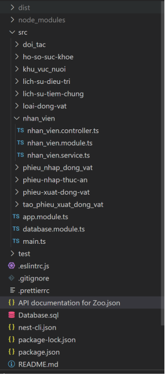</p>

The file "database.sql" contains the script to create the database. The file "API documentation for Zoo.json" contains information about the application's APIs.

### **Frontend**

<p align="center">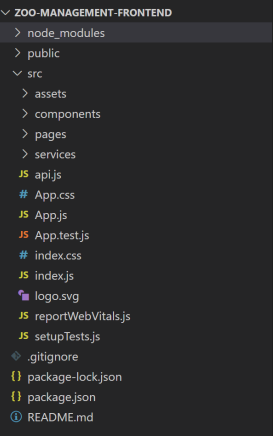</p>

- components: Contains reusable components.
- pages: Contains the application's pages, each of which may include multiple child components.
- services: Contains services used to call APIs.
## 📌**Implementation**

### **Application Programming Interface - API**

- **Animal Enclosure Area APIs**
  - `POST /khu-vuc-nuoi`
    - Description: Create a new animal enclosure area.
    - Parameters: Body: The data must follow the format of CreateKhuVucNuoiDto. 
    ```
    export class CreateKhuVucNuoiDto {
      vi_tri: string;
      suc_chua_toi_da: number;
      trang_thai_hoat_dong: string;
      dien_tich: number;
      chieu_cao: number;
      loai_moi_truong: string;
    }
    ```
    - Returns: The result of the creation, including information about the newly created enclosure area.
  - `GET /khu-vuc-nuoi`
    - Description: Retrieve a list of animal enclosure areas.
    - Parameters: page (query): Page index (default is 0). limit (query): Number of results per page (default is 10).
    - Returns: A list of enclosure areas based on the specified page and limit.
  - `GET /khu-vuc-nuoi/total-pages`
    - Description: Get the total number of enclosure area pages.
    - Parameters: limit (query): Number of results per page (default is 10).
    - Returns: Total number of enclosure area pages.
  - `GET /khu-vuc-nuoi/list`
    - Description: Get a list of all animal enclosure areas.
    - Returns: A list of all enclosure areas (not paginated).
  - `PATCH /khu-vuc-nuoi/:id`
    - Description: Update the activity status of an enclosure area by ID.
    - Parameters: id (param): The ID of the enclosure area to update. trang_thai_hoat_dong (body): New activity status of the enclosure area.
    - Returns: The result of the status update.
  - `GET /khu-vuc-nuoi/:id`
    - Description: Get detailed information of an enclosure area by ID.
    - Parameters: id (param): ID of the enclosure area to retrieve.
    - Returns: Detailed information of the specified enclosure area.
  - `DELETE /khu-vuc-nuoi/:id`
    - Description: Delete an enclosure area by ID.
    - Parameters: id (param): ID of the enclosure area to delete.
    - Returns: Result of the deletion.

- **Animal Feed Import Form APIs**
  - `POST /phieu-nhap-thuc-an`
    - Description: Create a new animal feed import form.
    - Parameters: Body: Data must follow the CreatePhieuNhapThucAnDto format.
    - Returns: The result of the creation, including the newly created form.
  - `GET /phieu-nhap-thuc-an`
    - Description: Retrieve a list of animal feed import forms.
    - Parameters: page (query): Page index (default is 0). limit (query): Number of results per page (default is 10).
    - Returns: A list of forms based on the specified page and limit.
  - `GET /phieu-nhap-thuc-an/total-pages`
    - Description: Get the total number of animal feed import form pages.
    - Parameters: limit (query): Number of results per page (default is 10).
    - Returns: Total number of pages.
  - `GET /phieu-nhap-thuc-an/:id`
    - Description: Get detailed information of an animal feed import form by ID.
    - Parameters: id (param): ID of the form to retrieve.
    - Returns: Detailed information of the specified form.
  - `GET /phieu-nhap-thuc-an/thucan`
    - Description: Get feed information from a specific import form.
    - Parameters: id (body): ID of the import form to retrieve feed information.
    - Returns: Feed information of the corresponding form.
  - `DELETE /phieu-nhap-thuc-an/:id`
    - Description: Delete an animal feed import form by ID.
    - Parameters: id (param): ID of the form to delete.
    - Returns: Result of the deletion.

- **Animal Import Form APIs**
  - `POST /phieu-nhap-dong-vat`
    - Description: Create a new animal import form.
    - Parameters: Body: Data must follow the format of CreatePhieuNhapDongVatDto.
    - Returns: The result of the creation, including the newly created form.
  - `GET /phieu-nhap-dong-vat`
    - Description: Retrieve a list of animal import forms.
    - Parameters: page (query): Page index (default is 0). limit (query): Number of results per page (default is 10).
    - Returns: A list of forms based on the specified page and limit.
  - `GET /phieu-nhap-dong-vat/total-pages`
    - Description: Get the total number of animal import form pages.
    - Parameters: limit (query): Number of results per page (default is 10).
    - Returns: Total number of pages.
  - `GET /phieu-nhap-dong-vat/:id`
    - Description: Get detailed information of an animal import form by ID.
    - Parameters:id (param): ID of the form to retrieve.
    - Returns: Detailed information of the specified form.
  - `DELETE /phieu-nhap-dong-vat/id`
    - Description: Delete an animal import form by ID.
    - Parameters: id(body): ID of the form to delete.
    - Returns: Result of the deletion.

- **Animal Species APIs**
  - `POST /loai-dong-vat/create`
    - Description: Create a new animal species.
    - Parameters: Body: Must follow the structure of CreateLoaiDongVatDto. Response: Result of the creation, including the newly created species data.
  - `POST /loai-dong-vat/create/cathe`
    - Description: Create a new individual animal of a species.
    - Parameters: Body: Must follow the structure of CreateCaTheDto. Response: Result of the creation, including the newly created individual data.
  - `POST /loai-dong-vat/create/nhom`
    - Description: Create a new animal group for a species.
    - Parameters: Body: Must follow the structure of CreateNhomDto. Response: Result of the creation, including the newly created group data.
  - `GET /loai-dong-vat/cathe`
    - Description: Get a list of individual animals based on scientific name and gender.
    - Parameters: ten_khoa_hoc (query): Scientific name of the species (default: ""). gioi_tinh (query): Gender of the individual (0: both genders, 1: female). Response: List of individual animals matching the given criteria.
  - `GET /loai-dong-vat/getallLDV`
    - Description: Retrieve a list of all animal species.
    - Parameters: None. Response: A list of all animal species.
- **Office Staff APIs**
  - `GET /nhan-vien/vanphong`
    - Description: Get a list of all office staff.
    - Parameters: None. Response: A list of all office staff.
- **Animal Export Record APIs**
  - `GET /phieu-xuat-dong-vat/all`
    - Description: Get a list of all animal export records from the database.
    - Workflow: Client sends a GET request to the /all endpoint. Connects to the database using MySQL Pool. Calls the stored procedure CALL get_all_phieu_xuat_dong_vat() to fetch data. Processes the returned data:If rows[0] is a valid array, map fields to GetPhieuXuatDongVatDto. Otherwise, return a data format error. Return the formatted list of export records.
  - Response Format:
    - Status Code: 200 OK
    - Body: Array of animal export record objects.
      
      ```
      [
        {
          "id_px": 1,
          "ten_khoa_hoc": "Panthera leo",
          "ngay_xuat": "2024-12-15",
          "so_luong": 2,
          "ly_do_xuat": "Transferred to sanctuary",
          "id_dt": 5,
          "cccd": "123456789",
          "loai": "Group"
        },
        {
          "id_px": 2,
          "ten_khoa_hoc": "Elephas maximus",
          "ngay_xuat": "2024-12-14",
          "so_luong": 1,
          "ly_do_xuat": "Conservation handover",
          "id_dt": 3,
          "cccd": "987654321",
          "loai": "Individual"
        }
      ]
      ```

  - `GET /phieu-xuat-dong-vat/details/:ID_phieu_xuat_dong_vat`
    - Description: Get details of an animal export record by its ID.
    - URL Parameter: ID_phieu_xuat_dong_vat (string): ID of the export record to retrieve.
    - Workflow: Send a GET request with the export ID. Call stored procedure CALL get_phieu_xuat_dong_vat_chi_tiet(?). Return 404 if no data is found. Otherwise, map data to GetPhieuXuatDongVatChiTietDto.
    - Response Format:
      - Status Code: 200 OK
      - Body: Detailed object of the export record.
    - Sample Response:

      ```
      [
        {
          "ten_nguoi_tao": "Nguyen Van A",
          "address": "123 Main Street",
          "cccd": "123456789",
          "id_dt": 5,
          "ten_doi_tac": "Zoo Partner",
          "ten_khoa_hoc": "Panthera leo",
          "ten_loai": "Lion",
          "do_quy_hiem": "Endangered",
          "loai_thuc_an": "Meat",
          "loai_moi_truong_song": "Savanna",
          "loai": "Individual"
        }
      ]
      ```

- **APIs for Creating Animal Export Records**
  - `POST /tao-phieu-xuat-dong-vat/createGroup`
    - Description: Create an animal export record for a group.
    - Request Body:

      ```
      {
        "ldv": "Panthera leo", // Species
        "id_nhom": 10, // Group ID
        "so_luong_xuat": 5, // Quantity to export
        "ngay_xuat": "2024-12-15", // Export date
        "ly_do_xuat": "Transfer", // Reason
        "doi_tac": "Zoo Partner", // Partner
        "cccd": "123456789" // Staff's CCCD
      }
      ```

  - Workflow: Verify that the CCCD exists. Confirm that id_nhom and ldv are valid.Ensure so_luong_xuat does not exceed available amount.Call stored procedure tao_phieu_xuat_dong_vat.
  - Response Format: Status Code: 200 OK
  - Body:
    ```
    {
    "message": "Animal export record successfully created!"
    }
    ```
  - `POST /tao-phieu-xuat-dong-vat/createct`
    - Description: Create an export record for individual animals.
    - Request Body:
      ```
        {
          "ldv": "Panthera leo", // Species
          "id_ct": [1, 2, 3], // Array of individual IDs
          "so_luong_xuat": 3, // Quantity to export
          "ngay_xuat": "2024-12-15", // Export date
          "ly_do_xuat": "Transfer", // Reason
          "doi_tac": "Zoo Partner", // Partner
          "cccd": "123456789" // Staff's CCCD
        }
      ```
    - Workflow: Verify that the CCCD exists. Ensure id_ct is an array. Validate each id_ct matches the species. Call stored procedure tao_phieu_xuat_dong_vat.
    - Response Format: Status Code: 200 OK
      - Body:
        ```
        {
          "message": "Animal export record successfully created!"
        }
        ```

  - `GET /tao-phieu-xuat-dong-vat/ct`
    - Description: Get information about individual animals.
    - Workflow: Connect to the database. Call stored procedure get_ct_info() to fetch individual info. Return the result list.
    - Response Format: Status Code: 200 OK
      - Body:
        ```
        [
          {
            "ten_khoa_hoc": "Panthera leo",
            "id_ct": 1,
            ...
          },
          ...
        ]
        ```
  - `GET /tao-phieu-xuat-dong-vat/nhom`
    - Description: Get information about animal groups.
    - Workflow: Connect to the database. Call stored procedure get_nhom_info() to fetch group info. Return the result list.
    - Response Format: Status Code: 200 OK
      - Body:
        ```
          [
          {
            "id_nhom": 1,
            "ten_khoa_hoc": "Panthera leo",
            "so_luong": 10,
            "mo_ta": "Lion group in area A",
            ...
          },
          ...
        ]
        ```
  - `GET /tao-phieu-xuat-dong-vat/getdoitac`
    - Description: Get the list of partners, including their IDs and names.
    - Workflow: Connect to the database. Call stored procedure get_ten_doi_tac_info() to fetch partner info. Format the result as an array of objects with id_dt and ten_doi_tac. Return the formatted list.
    - Response Format: Status Code: 200 OK
      - Body:
        ```
        [
          {
            "id_dt": 1,
            "ten_doi_tac": "ABC Company"
          },
          {
            "id_dt": 2,
            "ten_doi_tac": "XYZ Company"
          },
          ...
        ]
        ```

- **Veterinarian APIs**
  - `GET /ho-so-suc-khoe/all`
    - Description: Retrieve a list of health records with support for pagination and search by health record ID or scientific name.
    - Parameters: page (query): Page number (default is 1). pageSize (query): Number of records per page (default is 10). searchId (query): Health record ID (default is "null"). searchName (query): Scientific name of the species (default is "null").
    - Returns: A list of general information about health records.
  - `GET /ho-so-suc-khoe/details/:ID_ho_so_suc_khoe`
    - Description: Retrieve detailed information of a specific health record.
    - Parameter: Health record ID
    - Returns: Detailed information of the health record including basic data, treatment history, and vaccination history.
  - `POST /lich-su-dieu-tri/create`
    - Description: Add a treatment history entry to a health record.
    - Parameter:  Body: The data sent must follow the CreateLichSuDieuTriDto format.
    - Returns: message: "Treatment history has been successfully created!"
  - `POST /lich-su-tiem-chung/create`
    - Description: Add a vaccination history entry to a health record.
    - Parameter: Body: The data sent must follow the CreateLichSuTiemChungDto format.
    - Returns: message: "Vaccination history has been successfully created!"

## 📌**DEMO Features**

<p align="center">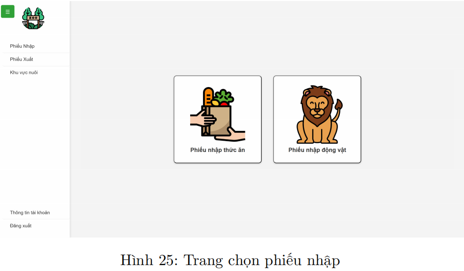</p>
<p align="center">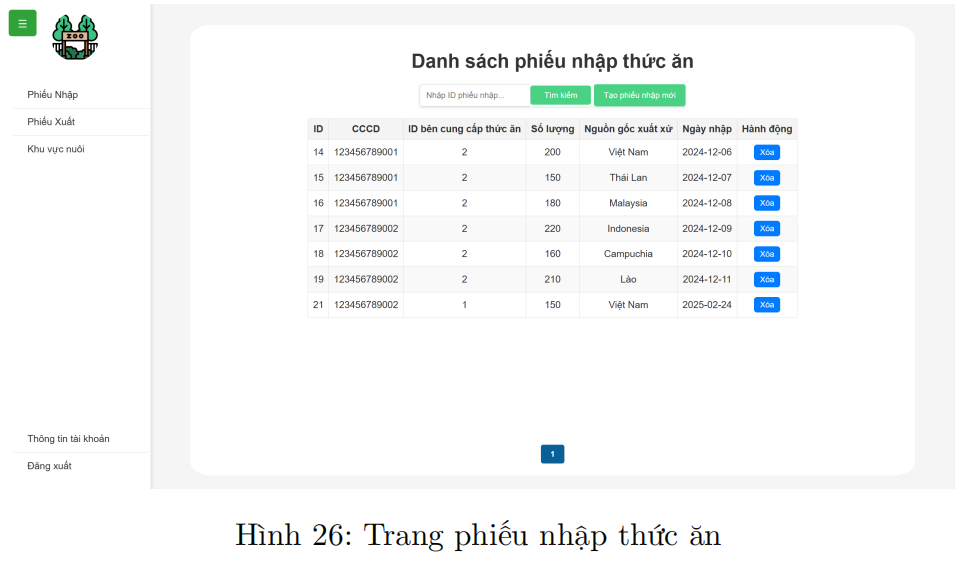</p>
<p align="center">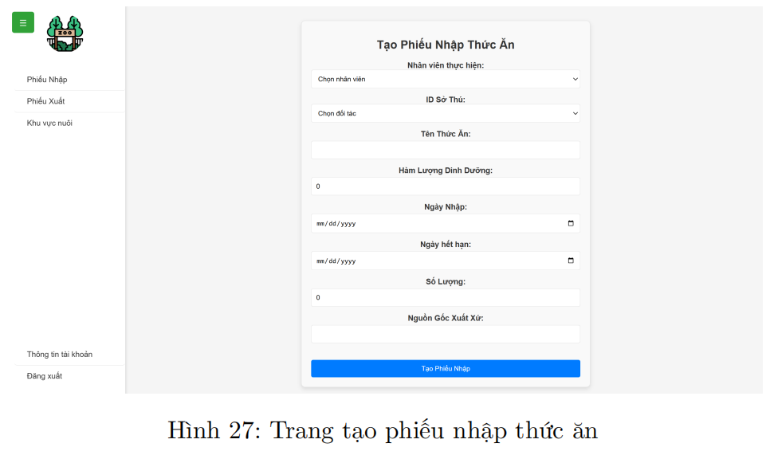</p>
<p align="center">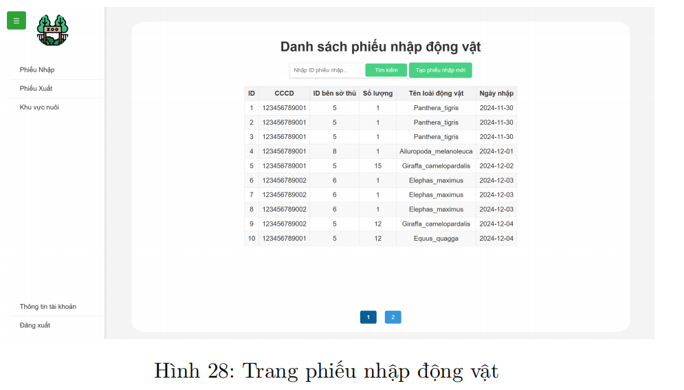</p>
<p align="center">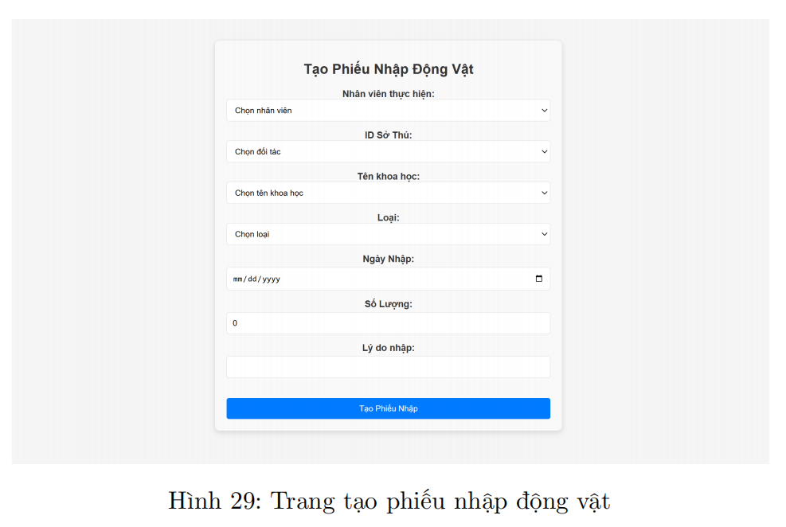</p>
<p align="center">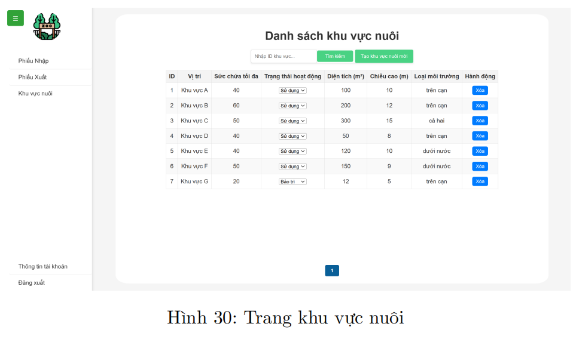</p>
<p align="center">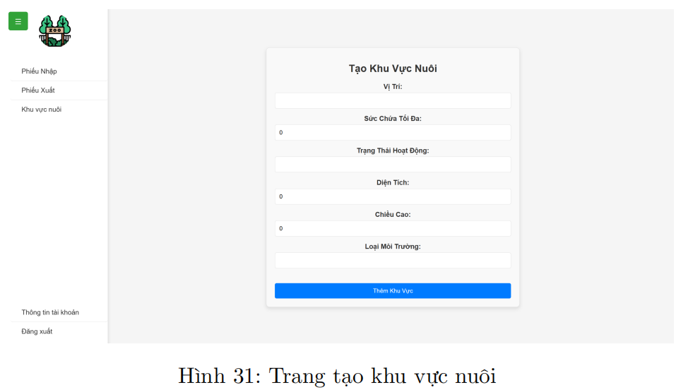</p>
<p align="center">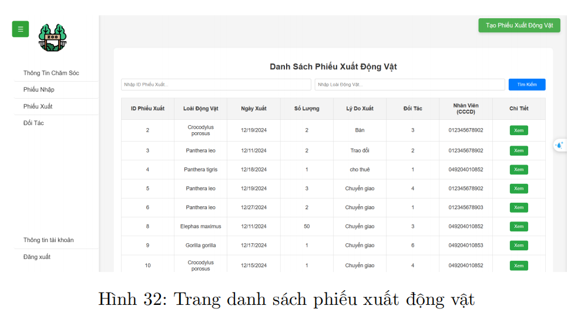</p>
<p align="center">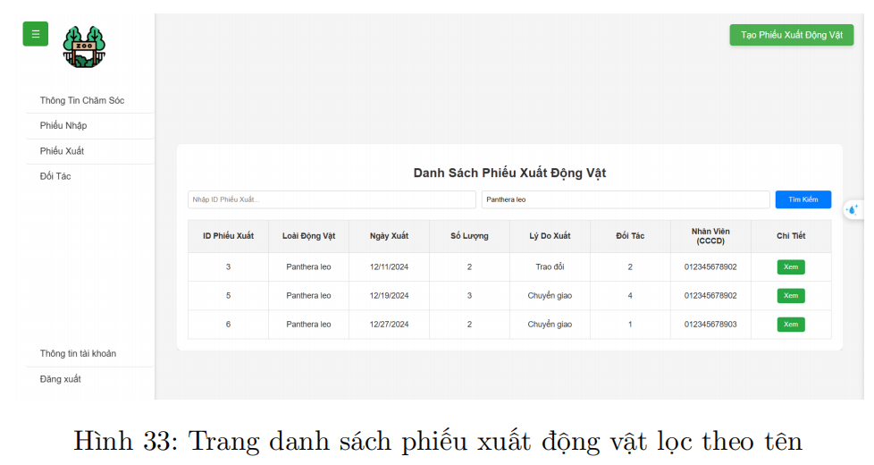</p>
<p align="center">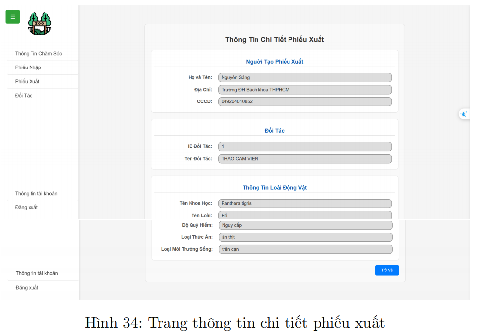</p>
<p align="center">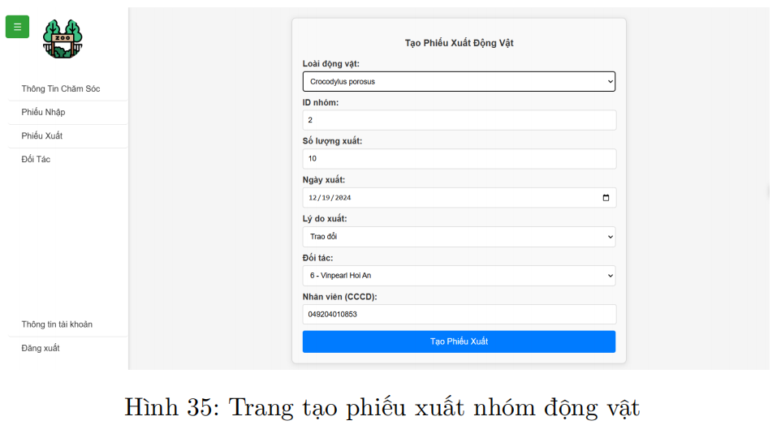</p>
<p align="center">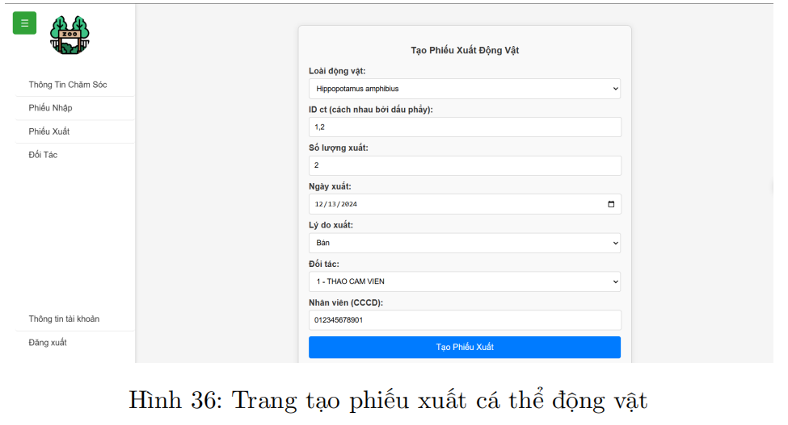</p>
<p align="center">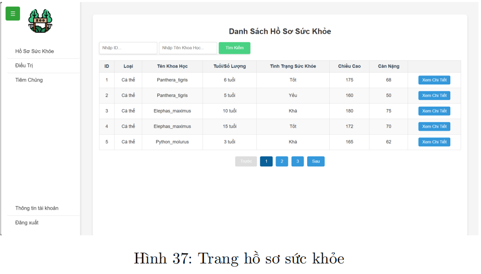</p>
<p align="center">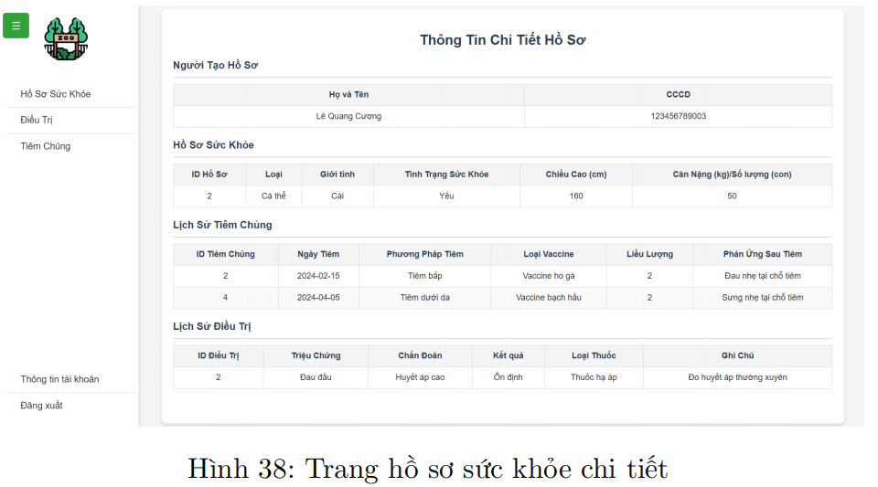</p>
<p align="center"></p>
<p align="center">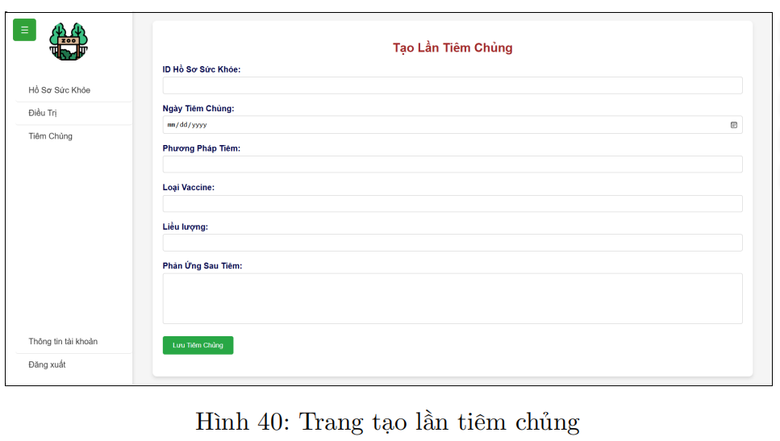</p>


## 📌**Installation Guide**
### Project setup

```bash
$ npm install
```

### Compile and run the project

```bash
# development
$ npm run start

# watch mode
$ npm run start:dev

# production mode
$ npm run start:prod
```

## 🏆Contributors
This project was successfully developed thanks to the dedication and effort of the following contributors:
1. Trần Nam Sơn - 2212956
2. Nguyễn Quang Sáng - 2212922
3. Trần Quang Tác - 2212962

🎉🎉🎉 Thank you for checking out this project! 🚀


