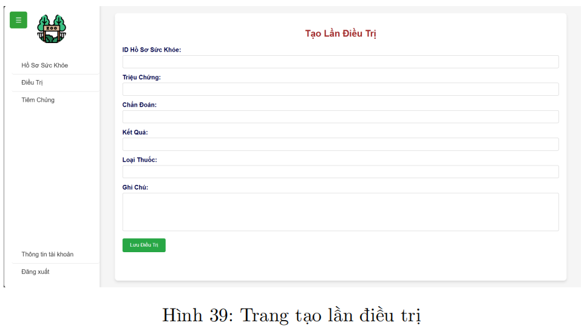

# <p align = 'center'>**Zoo Management System - ZMS**</p>
<p align ='center'> Developed by TeamDB - L10 - HK241</p> 

## Table of content
- [Introduction](#introduction)
- [Technologies Used](#technologies-used)
- [Source code](#source-code)
- [Data Requirements Description for the Zoo Management System](#data-requirements-description-for-the-zoo-management-system)
- [Semantic Constraints](#semantic-constraints)
- [Enhanced Entity-Relationship Diagram and Mapping](#enhanced-entity---relationship-diagram-eerd-and-mapping)
- [Database Schema Design in MySQL](#database-schema-design-in-mysql)
- [Source Code Structure](#source-code-structure)
- [Implementation](#implementation)
- [DEMO Features](#demo-features)
- [Installation Guide](#installation-guide)
- [Contributors](#contributors)

## **📌Introduction**
🦁 The Zoo Management System is a comprehensive application that supports the digital transformation of modern zoos. It provides powerful tools for managing animal species, individual animals, staff (including office workers, caretakers, and veterinarians), and diverse partner types such as food suppliers, research institutions, and other zoos. The system allows tracking of health records, vaccination history, treatment logs, and nutrition plans for both individual animals and groups. 

🦁 It also manages enclosures, feeding schedules, specimen records, and the logistics of animal import/export operations. With rich relational data handling, it ensures accurate monitoring of predator-prey relationships, breeding records, and parentage, supporting both operational and conservation needs.

<p align="center"></p>
<p align="center"></p>

## 🛠**Technologies Used**

- Frontend: `HTML, CSS, JS(ReactJS)` – Used to build a responsive and user-friendly web interface.

- Backend: `NestJS` – A progressive Node.js framework used to create a structured and scalable server-side application. It communicates with the database through stored procedures and functions.
- Database: `MySQL` – Relational database system used to store and manage zoo data, with business logic implemented through stored procedures and functions.

- API & Testing: `Postman` – A powerful API testing and debugging tool, streamlining API development and ensuring reliability through structured request-response testing.

- Version Control & Collaboration: `GitHub` – A cloud-based version control system facilitating seamless code management, collaboration, and deployment with features like branching, pull requests, and issue tracking.

- **Features**:
  - ✅ Authentication & Authorization
  - ✅ CRUD operations for zoo data (animals, health records, partners, etc.)

> ⚠️ You can create your own local database using the `Database.sql` file provided in the root directory.

<p align="center">
  <a href="http://nestjs.com/" target="blank"></a>
</p>

[circleci-image]: https://img.shields.io/circleci/build/github/nestjs/nest/master?token=abc123def456
[circleci-url]: https://circleci.com/gh/nestjs/nest

  <p align="center">A progressive <a href="http://nodejs.org" target="_blank">Node.js</a> framework for building efficient and scalable server-side applications.</p>
    <p align="center">
<a href="https://www.npmjs.com/~nestjscore" target="_blank"></a>
<a href="https://www.npmjs.com/~nestjscore" target="_blank"></a>
<a href="https://www.npmjs.com/~nestjscore" target="_blank"></a>
<a href="https://circleci.com/gh/nestjs/nest" target="_blank"></a>
<a href="https://coveralls.io/github/nestjs/nest?branch=master" target="_blank"></a>
<a href="https://discord.gg/G7Qnnhy" target="_blank"></a>
<a href="https://opencollective.com/nest#backer" target="_blank"></a>
<a href="https://opencollective.com/nest#sponsor" target="_blank"></a>
  <a href="https://paypal.me/kamilmysliwiec" target="_blank"></a>
    <a href="https://opencollective.com/nest#sponsor"  target="_blank"></a>
  <a href="https://twitter.com/nestframework" target="_blank"></a>
</p>
  <!--[](https://opencollective.com/nest#backer)
  [](https://opencollective.com/nest#sponsor)-->


## 🚀**Source code:**
## 📌**Data Requirements Description for the Zoo Management System** 
## 📌**Semantic Constraints** 
## 📌**Enhanced Entity-Relationship Diagram EERD and Mapping**
## 📌**Database Schema Design in MySQL** 
## 📌**Procedure, Trigger, and Function** 
## 📌**Source Code Structure** 
## 📌**Implementation**
## 📌**DEMO Features**

<p align="center"></p>
<p align="center"></p>
<p align="center"></p>
<p align="center"></p>
<p align="center"></p>
<p align="center"></p>
<p align="center"></p>
<p align="center"></p>
<p align="center"></p>
<p align="center"></p>
<p align="center"></p>
<p align="center"></p>
<p align="center"></p>
<p align="center"></p>
<p align="center"></p>
<p align="center"></p>


## 📌**Installation Guide**
### Project setup

```bash
$ npm install
```

### Compile and run the project

```bash
# development
$ npm run start

# watch mode
$ npm run start:dev

# production mode
$ npm run start:prod
```

## 🏆Contributors
This project was successfully developed thanks to the dedication and effort of the following contributors:
1. Trần Nam Sơn - 2212956
2. Nguyễn Quang Sáng - 2212922
3. Trần Quang Tác - 2212962

🎉🎉🎉 Thank you for checking out this project! 🚀


