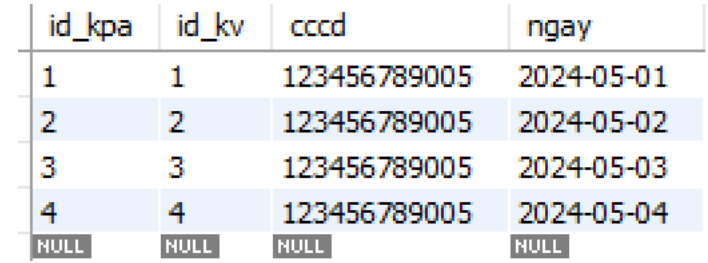
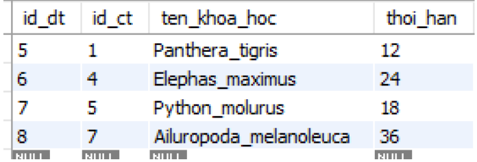

# <p align = 'center'>**Zoo Management System - ZMS**</p>
<p align ='center'> Developed by TeamDB - L10 - HK241</p> 

## Table of content
- [Introduction](#introduction)
- [Technologies Used](#technologies-used)
- [Source code](#source-code)
- [Data Requirements Description for the Zoo Management System](#data-requirements-description-for-the-zoo-management-system)
- [Semantic Constraints](#semantic-constraints)
- [Enhanced Entity-Relationship Diagram and Mapping](#enhanced-entity---relationship-diagram-eerd-and-mapping)
- [Database Schema Design in MySQL](#database-schema-design-in-mysql)
- [Source Code Structure](#source-code-structure)
- [Implementation](#implementation)
- [DEMO Features](#demo-features)
- [Installation Guide](#installation-guide)
- [Contributors](#contributors)

## **📌Introduction**
🦁 The Zoo Management System is a comprehensive application that supports the digital transformation of modern zoos. It provides powerful tools for managing animal species, individual animals, staff (including office workers, caretakers, and veterinarians), and diverse partner types such as food suppliers, research institutions, and other zoos. The system allows tracking of health records, vaccination history, treatment logs, and nutrition plans for both individual animals and groups. 

🦁 It also manages enclosures, feeding schedules, specimen records, and the logistics of animal import/export operations. With rich relational data handling, it ensures accurate monitoring of predator-prey relationships, breeding records, and parentage, supporting both operational and conservation needs.

<p align="center"></p>
<p align="center"></p>

## 🛠**Technologies Used**

- Frontend: `HTML, CSS, JS(ReactJS)` – Used to build a responsive and user-friendly web interface.

- Backend: `NestJS` – A progressive Node.js framework used to create a structured and scalable server-side application. It communicates with the database through stored procedures and functions.
- Database: `MySQL` – Relational database system used to store and manage zoo data, with business logic implemented through stored procedures and functions.

- API & Testing: `Postman` – A powerful API testing and debugging tool, streamlining API development and ensuring reliability through structured request-response testing.

- Version Control & Collaboration: `GitHub` – A cloud-based version control system facilitating seamless code management, collaboration, and deployment with features like branching, pull requests, and issue tracking.

- **Features**:
  - ✅ Authentication & Authorization
  - ✅ CRUD operations for zoo data (animals, health records, partners, etc.)

> ⚠️ You can create your own local database using the `Database.sql` file provided in the root directory.

<p align="center">
  <a href="http://nestjs.com/" target="blank"></a>
</p>

[circleci-image]: https://img.shields.io/circleci/build/github/nestjs/nest/master?token=abc123def456
[circleci-url]: https://circleci.com/gh/nestjs/nest

  <p align="center">A progressive <a href="http://nodejs.org" target="_blank">Node.js</a> framework for building efficient and scalable server-side applications.</p>
    <p align="center">
<a href="https://www.npmjs.com/~nestjscore" target="_blank"></a>
<a href="https://www.npmjs.com/~nestjscore" target="_blank"></a>
<a href="https://www.npmjs.com/~nestjscore" target="_blank"></a>
<a href="https://circleci.com/gh/nestjs/nest" target="_blank"></a>
<a href="https://coveralls.io/github/nestjs/nest?branch=master" target="_blank"></a>
<a href="https://discord.gg/G7Qnnhy" target="_blank"></a>
<a href="https://opencollective.com/nest#backer" target="_blank"></a>
<a href="https://opencollective.com/nest#sponsor" target="_blank"></a>
  <a href="https://paypal.me/kamilmysliwiec" target="_blank"></a>
    <a href="https://opencollective.com/nest#sponsor"  target="_blank"></a>
  <a href="https://twitter.com/nestframework" target="_blank"></a>
</p>
  <!--[](https://opencollective.com/nest#backer)
  [](https://opencollective.com/nest#sponsor)-->


## 🚀**Source code:**
The source code of the software can be accessed via the following link:

🔗 [Source code backend](https://github.com/tuitensonne/Zoo-backend)

🔗 [Source code frontend](https://github.com/tuitensonne/Zoo-frontend)

🔗 [UI/UX Design (Figma)](https://www.figma.com/design/ublOB0fGMaNA7qOHDUZynx/Untitled?node-id=0-1&t=DKyjMi1vJae1QkcB-1)

## 📌**Data Requirements Description for the Zoo Management System** 
### 🚀 **Staff – Office Staff – Caretakers – Veterinarians**:

The system needs to manage information about employees related to animals, including office staff, caretakers, and veterinarians. Each staff member has general information including:
- Citizen ID number (CCCD) (unique)
- Full name
- Address
- Job type
- Phone number(s) (one staff may have multiple)

Additional requirements based on role:
- `Office Staff`: must include information about qualifications
- `Caretakers`: must have an animal care certificate
- `Veterinarians`: must have a practicing license and years of experience

### 🚀 **Partners – Research Institutes – Zoos – Food Suppliers**:

The system must manage information about zoo partners, including food suppliers, educational institutions, zoos, and research institutes. Each partner includes:
- Partner ID (ID_DT) (unique)
- Name
- Contact info: email, address, and phone numbers (can be multiple)

Additional requirements:
- `Food Suppliers`: Must include food safety certifications (can be multiple). Ordering limits per food type (e.g., 50kg)
- `Zoos`: Type of zoo (public, private, non-profit). Conservation programs (e.g., species conservation, gene conservation)
- `Research Institutes`: Must include research fields

### 🚀 **Animal Species – Group – Individual – Enclosure – Specimen**:

Each animal species must have:
- Scientific name (unique)
- Common name
- Rarity level
- Type of food
- Reproduction cycle: cycle duration & gestation period
- Natural habitat
- Predator-prey relationships

- Animals can be tracked as `groups` or `individuals`:
  - Group:
    - Linked to species
    - Requires: Group ID (ID_N) and quantity
    - The combination of ID_N + species’ scientific name is unique
  - Individual:
    - Requires: ID_CT, DNA, gender, status, age
    - May include father and mother references

- Enclosure:
  - Enclosure ID (ID_KV) (unique)
  - Dimensions: area, height
  - Habitat type
  - Location
  - Maximum capacity
  - Activity status
  - Current quantity of animals (individuals + groups)
- Specimen:
  - Specimen ID (ID_MV)
  - Species
  - Specimen name
  - Condition
  - Collection date
 
### 🚀 **Nutrition Plan – Health Record – Treatment History – Vaccination History – Meal**:
- Nutrition Plan:
  - ID_CDDD (linked to health record)
  - Required water amount
  - Number of meals/day
  - Restricted foods
  - Minimum nutritional values
- Health Record:
  - ID_HSSK
  - Health status, height, weight
- Treatment History:
  - ID_DT, symptoms, medications, diagnosis, treatment outcome, notes, treatment date
- Vaccination History:
  - ID_TC, vaccine type, dosage, post-vaccine reaction, date, method of administration
- Meal:
  - Meal name, feeding time, species, and feeding date

### 🚀 **Import Forms – Animal Import – Food Import – Food – Animal Export**:
- Import Forms:
  - ID_PN, import date, quantity
  - Two types:
    - `Food Import`: requires origin/source
    - `Animal Import`: requires import reason
- Animal Export Forms:
  - ID_PX, export date, description (including quantity and reason)
- Food Item:
  - ID_TA, total quantity, name, nutritional content, expiration date

### 🚀 **Relationships**:

- Species–Predator-Prey:
  - A species can have multiple predators, and predators can hunt multiple prey
- Animal–Enclosure:
  - Each group/individual must reside in one `enclosure`
  - Each enclosure may contain multiple groups/individuals
- Animal–Health Record:
  - Each group/individual must have one health record
  - A health record can be linked to:
    - Multiple `nutrition plans`
    - Multiple `treatment histories`
    - Multiple `vaccination histories`
- Veterinarian Involvement:
  - Each health record must be modified by one veterinarian
  - Each veterinarian can modify multiple health records
  - Each nutrition plan is adjusted by one veterinarian
  - Each nutrition plan can be linked to multiple meals
- Caretaker Roles:
  - Performs meals for multiple enclosures
  - Each enclosure is cared for based on one meal at a specific time by one caretaker
  - A caretaker may serve multiple meals for the same enclosure at different times
  - Feeding date must be recorded
- Office Staff & Forms:
  - One office staff may create multiple: `Import forms`, `Animal export forms`
- Food Import – Supplier:
  - Each food import form is linked to one food supplier
  - One supplier may have multiple food import forms
- Food Item Usage:
  - A food item may appear in multiple food import forms
  - A meal may contain multiple food items
  - Must record quantity used per meal
- Animal Import/Export – Zoo Partners:
  - Each form is associated with one zoo
  - Each zoo partner may be involved in multiple imports/exports
- Animal Rental:
  - Individual animals may be rented out to other zoos
  - Each zoo may rent multiple individual animals
- Specimen Ownership:
  - Each `individual` may have multiple `specimens`
  - Each `specimen` belongs to one `individual`
  - `Research institutes` store specimens (one specimen belongs to one institute)
- Animal Lineage:
  - Each individual must have one father and one mother
  - One individual can be a parent of many others
- Group & Individual:
  - Animals may be in groups or individuals
  - A species might have no groups/individuals if population = 0
- Species Relations:
  - Each species:
    - Has multiple `groups`
    - Has multiple `individuals`
    - May be involved in `multiple import/export forms`
## 📌**Semantic Constraints** 
- The total `"quantity"` of all groups and individual animals with the status `"alive"` of a particular species must equal the `"quantity"` of that animal species.
- An animal species will by `default participate` in the "division" relationship if the user has not decided to assign it to either of the two relationships.
- If an individual `has a "has" relationship` with a specimen, it cannot be deleted unless the specimen is deleted first.
- The attribute `"habitat type"` of an animal species must be one of the three values: terrestrial, aquatic, or both.
- The attribute `"food type"` must be one of the three values: carnivore, herbivore, or omnivore.
- The `quantity of an animal species` must not be negative.
- The `current number of animals` in an enclosure must be `less than or equal` to its `maximum capacity`.
- When an `animal import` form is created, the `quantity of the animal species` must be `increased` by the quantity in the import form.
- When an `animal export` form is created, the `quantity of the animal species` must be `decreased` by the quantity in the export form.
- The `habitat type of the enclosure` must `match the habitat type` of the animal species housed in it.
- The `group quantity must not be negative`.
- The `current quantity` of animals in an enclosure must not be negative.
- Animal species that are `prey` of other species (in the recursive `"eats" relationship`) **cannot be housed in the same enclosure** as their predator species.
- The `"gender"` attribute of an individual must be one of three values: `"hermaphrodite", "male", or "female".`
- The `"status"` attribute of an individual must be one of five values: `"dead", "for rent", "sold", "alive", or "rented".`
- The `activity status` of an enclosure must be one of two values: `"in use"` or `"under maintenance".`

## 📌**Enhanced Entity-Relationship Diagram EERD and Mapping**
### **EERD Diagram**

<p align="center"></p>

### **Mapping to Relational Schema**

<p align="center"></p>

## 📌**Database Schema Design in MySQL** 

- Data Insertion
  - Animal Species
<p align="center"></p>
  - Predation
<p align="center"></p>
  - Enclosure
<p align="center"></p>
  - Staff
<p align="center"></p>
  - Staff Phone Numbers
<p align="center"></p>
  - Office Staff
<p align="center"></p>
  - Veterinarians
<p align="center"></p>
  - Caretakers
<p align="center"></p>
  - Health Records
<p align="center"></p>
  - Vaccination History
<p align="center"></p>
  - Treatment History
<p align="center"></p>
  - Nutrition Plan
<p align="center"></p>
  - Restricted Foods
<p align="center"></p>
  - Meal
<p align="center"></p>
  - Feeding Process
<p align="center"></p>
  - Food Items
<p align="center"></p>
  - Partners
<p align="center"></p>
  - Partner Contact Details
<p align="center"></p>
  - Research Institute Partners
<p align="center"></p>
  - Zoo Partners
<p align="center"></p>
  - Zoo Conservation Programs
<p align="center"></p>
  - Food Supplier Partners
<p align="center"></p>
  - Food Safety Certifications
<p align="center"></p>
  - Import Forms
<p align="center"></p>
  - Food Import Forms
<p align="center"></p>
  - Animal Import Forms
<p align="center"></p>
  - Individual Animals
<p align="center"></p>
  - Animal Groups
<p align="center"></p>
  - Rented Individuals
<p align="center"></p>
  - Animal Export Forms
<p align="center"></p>
  - Specimens
<p align="center"></p>

## 📌**Procedure, Trigger, and Function** 

## 📌**Source Code Structure** 

## 📌**Implementation**
### **Application Programming Interface - API**

- **Animal Enclosure Area APIs**
  - `POST /khu-vuc-nuoi`
    - Description: Create a new animal enclosure area.
    - Parameters: Body: The data must follow the format of CreateKhuVucNuoiDto. 
    ```
    export class CreateKhuVucNuoiDto {
      vi_tri: string;
      suc_chua_toi_da: number;
      trang_thai_hoat_dong: string;
      dien_tich: number;
      chieu_cao: number;
      loai_moi_truong: string;
    }
    ```
    - Returns: The result of the creation, including information about the newly created enclosure area.
  - `GET /khu-vuc-nuoi`
    - Description: Retrieve a list of animal enclosure areas.
    - Parameters: page (query): Page index (default is 0). limit (query): Number of results per page (default is 10).
    - Returns: A list of enclosure areas based on the specified page and limit.
  - `GET /khu-vuc-nuoi/total-pages`
    - Description: Get the total number of enclosure area pages.
    - Parameters: limit (query): Number of results per page (default is 10).
    - Returns: Total number of enclosure area pages.
  - `GET /khu-vuc-nuoi/list`
    - Description: Get a list of all animal enclosure areas.
    - Returns: A list of all enclosure areas (not paginated).
  - `PATCH /khu-vuc-nuoi/:id`
    - Description: Update the activity status of an enclosure area by ID.
    - Parameters: id (param): The ID of the enclosure area to update. trang_thai_hoat_dong (body): New activity status of the enclosure area.
    - Returns: The result of the status update.
  - `GET /khu-vuc-nuoi/:id`
    - Description: Get detailed information of an enclosure area by ID.
    - Parameters: id (param): ID of the enclosure area to retrieve.
    - Returns: Detailed information of the specified enclosure area.
  - `DELETE /khu-vuc-nuoi/:id`
    - Description: Delete an enclosure area by ID.
    - Parameters: id (param): ID of the enclosure area to delete.
    - Returns: Result of the deletion.

- **Animal Feed Import Form APIs**
  - `POST /phieu-nhap-thuc-an`
    - Description: Create a new animal feed import form.
    - Parameters: Body: Data must follow the CreatePhieuNhapThucAnDto format.
    - Returns: The result of the creation, including the newly created form.
  - `GET /phieu-nhap-thuc-an`
    - Description: Retrieve a list of animal feed import forms.
    - Parameters: page (query): Page index (default is 0). limit (query): Number of results per page (default is 10).
    - Returns: A list of forms based on the specified page and limit.
  - `GET /phieu-nhap-thuc-an/total-pages`
    - Description: Get the total number of animal feed import form pages.
    - Parameters: limit (query): Number of results per page (default is 10).
    - Returns: Total number of pages.
  - `GET /phieu-nhap-thuc-an/:id`
    - Description: Get detailed information of an animal feed import form by ID.
    - Parameters: id (param): ID of the form to retrieve.
    - Returns: Detailed information of the specified form.
  - `GET /phieu-nhap-thuc-an/thucan`
    - Description: Get feed information from a specific import form.
    - Parameters: id (body): ID of the import form to retrieve feed information.
    - Returns: Feed information of the corresponding form.
  - `DELETE /phieu-nhap-thuc-an/:id`
    - Description: Delete an animal feed import form by ID.
    - Parameters: id (param): ID of the form to delete.
    - Returns: Result of the deletion.

- **Animal Import Form APIs**
  - `POST /phieu-nhap-dong-vat`
    - Description: Create a new animal import form.
    - Parameters: Body: Data must follow the format of CreatePhieuNhapDongVatDto.
    - Returns: The result of the creation, including the newly created form.
  - `GET /phieu-nhap-dong-vat`
    - Description: Retrieve a list of animal import forms.
    - Parameters: page (query): Page index (default is 0). limit (query): Number of results per page (default is 10).
    - Returns: A list of forms based on the specified page and limit.
  - `GET /phieu-nhap-dong-vat/total-pages`
    - Description: Get the total number of animal import form pages.
    - Parameters: limit (query): Number of results per page (default is 10).
    - Returns: Total number of pages.
  - `GET /phieu-nhap-dong-vat/:id`
    - Description: Get detailed information of an animal import form by ID.
    - Parameters:id (param): ID of the form to retrieve.
    - Returns: Detailed information of the specified form.
  - `DELETE /phieu-nhap-dong-vat/id`
    - Description: Delete an animal import form by ID.
    - Parameters: id(body): ID of the form to delete.
    - Returns: Result of the deletion.

- **Animal Species APIs**
  - `POST /loai-dong-vat/create`
    - Description: Create a new animal species.
    - Parameters: Body: Must follow the structure of CreateLoaiDongVatDto. Response: Result of the creation, including the newly created species data.
  - `POST /loai-dong-vat/create/cathe`
    - Description: Create a new individual animal of a species.
    - Parameters: Body: Must follow the structure of CreateCaTheDto. Response: Result of the creation, including the newly created individual data.
  - `POST /loai-dong-vat/create/nhom`
    - Description: Create a new animal group for a species.
    - Parameters: Body: Must follow the structure of CreateNhomDto. Response: Result of the creation, including the newly created group data.
  - `GET /loai-dong-vat/cathe`
    - Description: Get a list of individual animals based on scientific name and gender.
    - Parameters: ten_khoa_hoc (query): Scientific name of the species (default: ""). gioi_tinh (query): Gender of the individual (0: both genders, 1: female). Response: List of individual animals matching the given criteria.
  - `GET /loai-dong-vat/getallLDV`
    - Description: Retrieve a list of all animal species.
    - Parameters: None. Response: A list of all animal species.
- **Office Staff APIs**
  - `GET /nhan-vien/vanphong`
    - Description: Get a list of all office staff.
    - Parameters: None. Response: A list of all office staff.
- **Animal Export Record APIs**
  - `GET /phieu-xuat-dong-vat/all`
    - Description: Get a list of all animal export records from the database.
    - Workflow: Client sends a GET request to the /all endpoint. Connects to the database using MySQL Pool. Calls the stored procedure CALL get_all_phieu_xuat_dong_vat() to fetch data. Processes the returned data:If rows[0] is a valid array, map fields to GetPhieuXuatDongVatDto. Otherwise, return a data format error. Return the formatted list of export records.
  - Response Format:
    - Status Code: 200 OK
    - Body: Array of animal export record objects.
      
      ```
      [
        {
          "id_px": 1,
          "ten_khoa_hoc": "Panthera leo",
          "ngay_xuat": "2024-12-15",
          "so_luong": 2,
          "ly_do_xuat": "Transferred to sanctuary",
          "id_dt": 5,
          "cccd": "123456789",
          "loai": "Group"
        },
        {
          "id_px": 2,
          "ten_khoa_hoc": "Elephas maximus",
          "ngay_xuat": "2024-12-14",
          "so_luong": 1,
          "ly_do_xuat": "Conservation handover",
          "id_dt": 3,
          "cccd": "987654321",
          "loai": "Individual"
        }
      ]
      ```

  - `GET /phieu-xuat-dong-vat/details/:ID_phieu_xuat_dong_vat`
    - Description: Get details of an animal export record by its ID.
    - URL Parameter: ID_phieu_xuat_dong_vat (string): ID of the export record to retrieve.
    - Workflow: Send a GET request with the export ID. Call stored procedure CALL get_phieu_xuat_dong_vat_chi_tiet(?). Return 404 if no data is found. Otherwise, map data to GetPhieuXuatDongVatChiTietDto.
    - Response Format:
      - Status Code: 200 OK
      - Body: Detailed object of the export record.
    - Sample Response:

      ```
      [
        {
          "ten_nguoi_tao": "Nguyen Van A",
          "address": "123 Main Street",
          "cccd": "123456789",
          "id_dt": 5,
          "ten_doi_tac": "Zoo Partner",
          "ten_khoa_hoc": "Panthera leo",
          "ten_loai": "Lion",
          "do_quy_hiem": "Endangered",
          "loai_thuc_an": "Meat",
          "loai_moi_truong_song": "Savanna",
          "loai": "Individual"
        }
      ]
      ```

- **APIs for Creating Animal Export Records**
  - `POST /tao-phieu-xuat-dong-vat/createGroup`
    - Description: Create an animal export record for a group.
    - Request Body:

      ```
      {
        "ldv": "Panthera leo", // Species
        "id_nhom": 10, // Group ID
        "so_luong_xuat": 5, // Quantity to export
        "ngay_xuat": "2024-12-15", // Export date
        "ly_do_xuat": "Transfer", // Reason
        "doi_tac": "Zoo Partner", // Partner
        "cccd": "123456789" // Staff's CCCD
      }
      ```

  - Workflow: Verify that the CCCD exists. Confirm that id_nhom and ldv are valid.Ensure so_luong_xuat does not exceed available amount.Call stored procedure tao_phieu_xuat_dong_vat.
  - Response Format: Status Code: 200 OK
  - Body:
    ```
    {
    "message": "Animal export record successfully created!"
    }
    ```
  - `POST /tao-phieu-xuat-dong-vat/createct`
    - Description: Create an export record for individual animals.
    - Request Body:
      ```
        {
          "ldv": "Panthera leo", // Species
          "id_ct": [1, 2, 3], // Array of individual IDs
          "so_luong_xuat": 3, // Quantity to export
          "ngay_xuat": "2024-12-15", // Export date
          "ly_do_xuat": "Transfer", // Reason
          "doi_tac": "Zoo Partner", // Partner
          "cccd": "123456789" // Staff's CCCD
        }
      ```
    - Workflow: Verify that the CCCD exists. Ensure id_ct is an array. Validate each id_ct matches the species. Call stored procedure tao_phieu_xuat_dong_vat.
    - Response Format: Status Code: 200 OK
      - Body:
        ```
        {
          "message": "Animal export record successfully created!"
        }
        ```

  - `GET /tao-phieu-xuat-dong-vat/ct`
    - Description: Get information about individual animals.
    - Workflow: Connect to the database. Call stored procedure get_ct_info() to fetch individual info. Return the result list.
    - Response Format: Status Code: 200 OK
      - Body:
        ```
        [
          {
            "ten_khoa_hoc": "Panthera leo",
            "id_ct": 1,
            ...
          },
          ...
        ]
        ```
  - `GET /tao-phieu-xuat-dong-vat/nhom`
    - Description: Get information about animal groups.
    - Workflow: Connect to the database. Call stored procedure get_nhom_info() to fetch group info. Return the result list.
    - Response Format: Status Code: 200 OK
      - Body:
        ```
          [
          {
            "id_nhom": 1,
            "ten_khoa_hoc": "Panthera leo",
            "so_luong": 10,
            "mo_ta": "Lion group in area A",
            ...
          },
          ...
        ]
        ```
  - `GET /tao-phieu-xuat-dong-vat/getdoitac`
    - Description: Get the list of partners, including their IDs and names.
    - Workflow: Connect to the database. Call stored procedure get_ten_doi_tac_info() to fetch partner info. Format the result as an array of objects with id_dt and ten_doi_tac. Return the formatted list.
    - Response Format: Status Code: 200 OK
      - Body:
        ```
        [
          {
            "id_dt": 1,
            "ten_doi_tac": "ABC Company"
          },
          {
            "id_dt": 2,
            "ten_doi_tac": "XYZ Company"
          },
          ...
        ]
        ```

- **Veterinarian APIs**
  - `GET /ho-so-suc-khoe/all`
    - Description: Retrieve a list of health records with support for pagination and search by health record ID or scientific name.
    - Parameters: page (query): Page number (default is 1). pageSize (query): Number of records per page (default is 10). searchId (query): Health record ID (default is "null"). searchName (query): Scientific name of the species (default is "null").
    - Returns: A list of general information about health records.
  - `GET /ho-so-suc-khoe/details/:ID_ho_so_suc_khoe`
    - Description: Retrieve detailed information of a specific health record.
    - Parameter: Health record ID
    - Returns: Detailed information of the health record including basic data, treatment history, and vaccination history.
  - `POST /lich-su-dieu-tri/create`
    - Description: Add a treatment history entry to a health record.
    - Parameter:  Body: The data sent must follow the CreateLichSuDieuTriDto format.
    - Returns: message: "Treatment history has been successfully created!"
  - `POST /lich-su-tiem-chung/create`
    - Description: Add a vaccination history entry to a health record.
    - Parameter: Body: The data sent must follow the CreateLichSuTiemChungDto format.
    - Returns: message: "Vaccination history has been successfully created!"
    
## 📌**DEMO Features**

<p align="center"></p>
<p align="center"></p>
<p align="center"></p>
<p align="center"></p>
<p align="center"></p>
<p align="center"></p>
<p align="center"></p>
<p align="center"></p>
<p align="center"></p>
<p align="center"></p>
<p align="center"></p>
<p align="center"></p>
<p align="center"></p>
<p align="center"></p>
<p align="center"></p>
<p align="center"></p>


## 📌**Installation Guide**
### Project setup

```bash
$ npm install
```

### Compile and run the project

```bash
# development
$ npm run start

# watch mode
$ npm run start:dev

# production mode
$ npm run start:prod
```

## 🏆Contributors
This project was successfully developed thanks to the dedication and effort of the following contributors:
1. Trần Nam Sơn - 2212956
2. Nguyễn Quang Sáng - 2212922
3. Trần Quang Tác - 2212962

🎉🎉🎉 Thank you for checking out this project! 🚀


